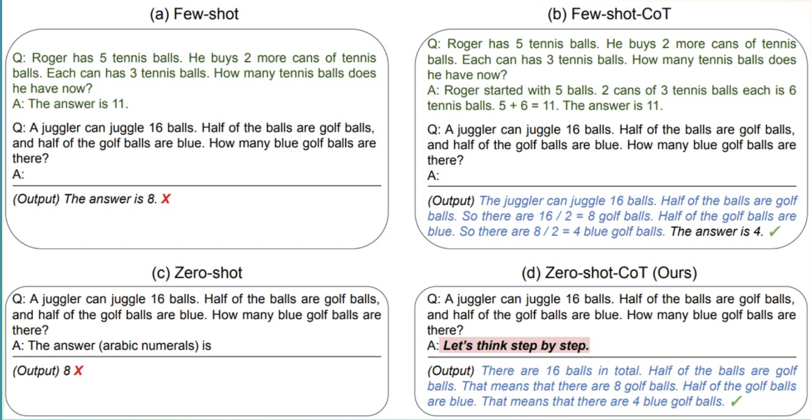

# Unit 1

## Introduction to Agents

https://huggingface.co/learn/agents-course/unit1/introduction

---


이 첫 번째 유닛에 오신 것을 환영합니다! 여기에서는 AI 에이전트의 기본 개념을 탄탄하게 다질 것입니다.

### 에이전트 이해하기
- 에이전트란 무엇이며, 어떻게 작동하는가?
- 에이전트는 추론과 계획을 통해 어떻게 결정을 내리는가?

### 에이전트에서 LLM(대형 언어 모델)의 역할
- LLM이 에이전트의 "두뇌" 역할을 하는 방식.
- LLM이 메시지 시스템을 통해 대화를 구성하는 방식.

### 도구와 액션
- 에이전트가 외부 도구를 활용하여 환경과 상호작용하는 방식.
- 에이전트를 위한 도구를 구축하고 통합하는 방법.

### 에이전트의 워크플로우
- 사고(Think) → 행동(Act) → 관찰(Observe).

이러한 주제를 탐색한 후, **smolagents**를 사용하여 첫 번째 에이전트를 구축하게 됩니다!

당신의 에이전트 **Alfred**는 간단한 작업을 수행하며, 이 개념들을 실제로 적용하는 방법을 보여줄 것입니다.

또한, **Hugging Face Spaces**에 에이전트를 배포하는 방법을 배워 친구들과 동료들에게 공유할 수도 있습니다.

마지막으로, 이 유닛이 끝나면 퀴즈를 치르게 됩니다. 통과하면 **🎓 에이전트 기본 과정 수료 인증서(Certificate of Fundamentals of Agents)**를 받게 됩니다! 🚀


이 유닛은 에이전트를 이해하기 위한 필수 출발점으로, 더 고급 주제로 나아가기 전에 기초를 탄탄히 다지는 과정입니다.

이 유닛은 내용이 많으니 천천히 학습하고, 필요할 때마다 다시 돌아와 복습해도 좋습니다.

준비됐나요? 함께 시작해봅시다! 🚀

---

## What is an Agent?


이 섹션이 끝나면, 에이전트 개념과 AI에서의 다양한 활용 방식에 대해 익숙해질 것입니다.

에이전트가 무엇인지 설명하기 위해, 비유를 들어 시작해 보겠습니다.

### 전체 개요: 에이전트 Alfred

Alfred를 소개합니다. Alfred는 에이전트입니다.


상상해보세요. Alfred가 다음과 같은 명령을 받습니다.
**"Alfred, 커피 한 잔 주세요."**


Alfred는 자연어를 이해할 수 있기 때문에 우리의 요청을 빠르게 파악합니다.

주문을 수행하기 전에, Alfred는 **추론과 계획(reasoning and planning)** 을 통해 필요한 단계와 도구를 결정합니다:

1. **주방으로 이동**
2. **커피 머신 사용**
3. **커피 추출**
4. **커피를 가져오기**


계획이 세워지면, Alfred는 행동해야 합니다. 계획을 실행하기 위해, 그는 자신이 알고 있는 **도구 목록**에서 적절한 도구를 선택하여 사용합니다.

이 경우, **커피를 만들기 위해 Alfred는 커피 머신을 사용**합니다.
그는 **커피 머신을 작동시켜 커피를 추출**합니다.


마지막으로, Alfred는 갓 추출한 커피를 우리에게 가져옵니다. ☕


이것이 바로 **에이전트(Agent)** 입니다.

에이전트는 **추론(reasoning), 계획(planning), 그리고 환경과의 상호작용(interacting with its environment)** 이 가능한 AI 모델입니다.

우리가 이것을 **에이전트(Agent)** 라고 부르는 이유는, **에이전시(agency)** 를 가지고 있기 때문입니다. 즉, **환경과 상호작용할 수 있는 능력**을 갖추고 있기 때문입니다.


### Let’s go more formal

좀 더 공식적으로 정리해봅시다

이제 전체 개념을 이해했으니, 더 정확한 정의를 살펴보겠습니다:

**에이전트(Agent)** 는 **AI 모델을 활용하여 환경과 상호작용하고, 사용자가 정의한 목표를 달성하는 시스템**입니다.
이는 **추론(reasoning), 계획(planning), 그리고 행동 실행(execution of actions, 주로 외부 도구 활용)** 을 결합하여 작업을 수행합니다.

에이전트는 두 가지 주요 부분으로 구성됩니다:

### **에이전트의 두 가지 주요 구성 요소**

1️⃣ **두뇌 (The Brain - AI 모델)**
   - 모든 **사고(thinking)** 과정이 이루어지는 부분입니다.
   - AI 모델이 **추론(reasoning)** 및 **계획(planning)** 을 담당합니다.
   - 상황에 따라 **어떤 행동(Actions)을 취할지 결정**합니다.

2️⃣ **몸 (The Body - 기능과 도구)**
   - 에이전트가 수행할 수 있는 모든 **기능과 도구(capabilities and tools)** 를 포함합니다.
   - 수행할 수 있는 행동의 범위는 **에이전트가 갖춘 도구와 기능에 따라 결정**됩니다.
   - 예를 들어, 인간에게는 **날개가 없으므로 "날기(fly)" 행동을 수행할 수 없지만**,
     대신 **"걷기(walk)", "달리기(run)", "점프하기(jump)", "잡기(grab)"** 같은 행동은 수행할 수 있습니다.

즉, **AI 모델이 사고하고 계획을 세우면, 이를 실행할 수 있는 도구와 기능이 결정된 범위 내에서 행동을 수행**하는 구조입니다. 🚀

### **에이전트에 사용되는 AI 모델 유형**

에이전트에서 가장 일반적으로 사용되는 AI 모델은 **LLM(대형 언어 모델, Large Language Model)** 입니다.

- **LLM은 텍스트를 입력받아 텍스트를 출력하는 모델**입니다.
- 대표적인 예로는 **OpenAI의 GPT-4, Meta의 LLaMA, Google의 Gemini** 등이 있습니다.
- 이러한 모델들은 방대한 양의 텍스트 데이터를 학습했으며, **일반화(generalization)** 능력이 뛰어납니다.
- 다음 섹션에서 LLM에 대해 더 자세히 알아볼 예정입니다.

### **다른 유형의 모델도 에이전트에 활용 가능**
- **에이전트의 핵심 모델**로 **다른 입력 유형을 처리할 수 있는 모델**을 사용할 수도 있습니다.
- 예를 들어, **VLM(비전-언어 모델, Vision Language Model)** 은 LLM과 유사하지만 **이미지를 입력으로 이해할 수 있는 모델**입니다.
- 하지만, 지금은 **LLM에 집중**하고, 이후에 다른 모델 옵션들을 다룰 예정입니다. 🚀

### **AI는 환경에서 어떻게 행동할까?**

LLM은 강력한 모델이지만, **기본적으로 텍스트만 생성할 수 있습니다**.

그런데 **HuggingChat**이나 **ChatGPT** 같은 챗봇에 **"이미지를 생성해줘"** 라고 요청하면, 실제로 이미지를 생성할 수 있습니다! 어떻게 이런 일이 가능할까요?

### **정답: 도구(Tools) 활용**
HuggingChat, ChatGPT 등의 애플리케이션 개발자들은 **추가 기능(Tools)을 구현하여** LLM이 이를 사용할 수 있도록 만들었습니다.

- LLM 자체는 **텍스트만 생성**하지만,
- **"이미지를 생성하는 도구"를 API 형태로 연결**하면,
- LLM은 이 도구를 활용하여 **이미지를 생성**할 수 있습니다.

이러한 방식으로 **에이전트는 외부 도구와 상호작용하며 환경에서 실제 행동을 수행할 수 있습니다**. 🚀


### **에이전트가 수행할 수 있는 작업은 무엇인가?**

에이전트는 **도구(Tools)를 통해 구현된 작업**을 수행할 수 있습니다.

예를 들어, **개인 비서 AI**를 만들고 싶다면, 이메일을 보내는 기능을 도구로 구현할 수 있습니다.
만약 사용자가 **"오늘 회의를 연기해달라고 매니저에게 이메일을 보내줘"** 라고 요청하면, 에이전트는 아래와 같이 도구를 활용할 수 있습니다:

```python
def send_message_to(recipient, message):
    """수신자에게 이메일을 보내는 기능"""
    ...
```

그리고 LLM은 필요할 때 이 도구를 실행하는 코드를 생성할 수 있습니다.

```python
send_message_to("Manager", "Can we postpone today's meeting?")
```

이처럼 **도구의 설계는 에이전트의 품질에 큰 영향을 미칩니다**.
- 어떤 작업은 **특정 목적의 맞춤형 도구**가 필요하지만,
- **웹 검색(web_search)** 같은 일반적인 도구로 해결할 수도 있습니다.

### **Actions와 Tools의 차이**
- **도구(Tools)**: 특정 작업을 수행하는 기능 (예: 이메일 보내기, 웹 검색)
- **행동(Actions)**: 여러 도구를 조합하여 수행하는 일련의 과정 (예: 회의 일정 조정 → 이메일 전송 → 캘린더 업데이트)

### **실제 사례에서의 에이전트 활용 예시**

#### **예제 1: 개인 가상 비서 (Virtual Assistants)**
- Siri, Alexa, Google Assistant 같은 가상 비서는 **사용자의 요청을 이해하고**,
- **디지털 환경에서 정보를 검색하거나**,
- **메시지 전송, 일정 설정, 스마트 기기 제어 등의 작업을 수행**합니다.

#### **예제 2: 고객 서비스 챗봇 (Customer Service Chatbots)**
- 많은 기업들이 **고객과 자연어로 소통하는 챗봇 에이전트**를 운영합니다.
- 고객의 질문에 답변하고, **문제 해결을 도와주거나, 데이터베이스에서 정보를 검색**,
- **내부 시스템에 이슈를 등록하거나, 트랜잭션을 완료**하는 등 다양한 작업을 수행할 수 있습니다.
- 이러한 에이전트는 **사용자 만족도를 높이고, 대기 시간을 줄이며, 매출을 증가시키는 역할**을 합니다.

#### **예제 3: 비디오 게임의 AI NPC (AI Non-Playable Character, NPC)**
- LLM을 활용한 AI NPC는 기존의 **고정된 행동 트리(Behavior Tree)** 대신,
- **플레이어의 상호작용에 따라 적응하며 보다 자연스러운 대화를 생성**할 수 있습니다.
- 이를 통해 **더 몰입감 있는 게임 경험을 제공**할 수 있습니다.

---

### **정리: 에이전트의 핵심 역할**
에이전트는 **AI 모델(주로 LLM)을 중심으로 동작하며**, 다음과 같은 기능을 수행합니다:

1️⃣ **자연어 이해(Natural Language Understanding)**
   - 인간의 명령을 해석하고, 의미 있는 방식으로 응답

2️⃣ **추론과 계획(Reasoning & Planning)**
   - 정보를 분석하고, 결정을 내리며, 문제를 해결하기 위한 전략을 수립

3️⃣ **환경과 상호작용(Interaction with Environment)**
   - 정보를 검색하고, 작업을 수행하며, 결과를 관찰하여 반응

---

이제 **에이전트의 개념을 확실히 이해했으므로**, 간단한 퀴즈로 복습한 후 **에이전트의 두뇌인 LLM에 대해 깊이 파고들어 보겠습니다**! 🚀

---

# What are LLMs?

이전 섹션에서는 **에이전트가 AI 모델을 필요로 하며, LLM이 가장 일반적인 선택**이라는 점을 배웠습니다.

이제 **LLM이 무엇인지, 그리고 어떻게 에이전트를 구동하는지** 살펴보겠습니다.

이 섹션에서는 **LLM의 활용을 기술적으로 간략히 설명**합니다.
더 깊이 알고 싶다면, **무료 자연어 처리(NLP) 강의**를 확인할 수도 있습니다.

### What is a Large Language Model?

**LLM(Large Language Model)** 은 **인간의 언어를 이해하고 생성하는 데 뛰어난 AI 모델**입니다.

- 방대한 **텍스트 데이터로 학습**하여, **언어의 패턴, 구조, 심지어 뉘앙스까지 학습**합니다.
- 일반적으로 **수백만~수천억 개의 파라미터**를 포함하는 거대한 모델입니다.

### **LLM의 핵심: Transformer 아키텍처**
현재 대부분의 LLM은 **Transformer 아키텍처**를 기반으로 구축됩니다.
- Transformer는 **"Attention" 알고리즘**을 활용하는 **딥러닝 모델**입니다.
- 2018년, Google이 발표한 **BERT** 모델 이후 크게 주목받기 시작했습니다.
- 이후 **GPT, LLaMA, Gemini 등 최신 LLM들도 Transformer 구조를 기반으로 동작**합니다.

👉 **LLM은 에이전트의 두뇌 역할을 하며, 자연어를 이해하고 텍스트를 생성하는 핵심 엔진으로 작동합니다.** 🚀


### **Transformer의 세 가지 유형**

#### **1️⃣ 인코더(Encoder) 기반 Transformer**
- 입력 텍스트(또는 데이터)를 **밀집된 표현(embedding)** 으로 변환
- **예제:** Google의 **BERT**
- **사용 사례:**
  - 텍스트 분류(Text Classification)
  - 의미 검색(Semantic Search)
  - 개체명 인식(NER, Named Entity Recognition)
- **모델 크기:** 수백만 개의 파라미터

---

#### **2️⃣ 디코더(Decoder) 기반 Transformer**
- **새로운 토큰을 한 번에 하나씩 생성**하여 문장을 완성하는 방식
- **예제:** Meta의 **LLaMA**
- **사용 사례:**
  - 텍스트 생성(Text Generation)
  - 챗봇(Chatbots)
  - 코드 생성(Code Generation)
- **모델 크기:** **수십억 개(10⁹)의 파라미터**

---

#### **3️⃣ Seq2Seq (Encoder-Decoder) Transformer**
- **인코더가 입력을 처리해 문맥(context) 표현을 생성한 후**,
  **디코더가 이를 바탕으로 새로운 시퀀스를 출력**
- **예제:** Google의 **T5, BART**
- **사용 사례:**
  - 기계 번역(Translation)
  - 텍스트 요약(Summarization)
  - 문장 변환(Paraphrasing)
- **모델 크기:** 수백만 개의 파라미터

---

### **대형 언어 모델(LLM)은 주로 디코더 기반**
- 다양한 형태의 Transformer 모델이 있지만, **대부분의 LLM은 디코더 기반 모델**입니다.
- LLM은 **수십억 개의 파라미터를 가지며**, 텍스트 생성 및 자연어 이해를 수행합니다.

👉 이제 가장 널리 사용되는 대표적인 LLM들을 살펴보겠습니다. 🚀

### **대표적인 LLM 모델과 제공자**

| **모델**       | **제공자** |
|---------------|-----------|
| **Deepseek-R1** | DeepSeek  |
| **GPT-4**      | OpenAI    |
| **Llama 3**    | Meta (Facebook AI Research) |
| **SmolLM2**    | Hugging Face |
| **Gemma**      | Google    |
| **Mistral**    | Mistral   |

---

### **LLM의 핵심 원리: 다음 토큰 예측 (Next Token Prediction)**

LLM의 동작 원리는 **매우 간단하지만 강력**합니다.
👉 **이전 토큰들의 시퀀스를 기반으로 다음 토큰을 예측**하는 것이 목표입니다.

#### **토큰(Token)이란?**
- **토큰은 LLM이 처리하는 기본 단위**입니다.
- 흔히 **단어(word)와 유사하지만**, LLM은 효율성을 위해 **완전한 단어가 아닌 부분 단위(sub-word units)를 사용**합니다.
- 예를 들어, 영어에는 약 **60만 개의 단어**가 있지만, **LLaMA 2의 어휘(vocabulary)는 약 32,000개의 토큰**으로 구성됩니다.
- 따라서 **하나의 단어가 여러 개의 토큰으로 나뉠 수 있음**.

#### **토큰화(Tokenization)의 예시**
다음과 같이 **하나의 단어가 여러 개의 토큰으로 분할**될 수 있습니다:

- `"interest"` + `"ing"` → `"interesting"`
- `"interest"` + `"ed"` → `"interested"`

이러한 방식으로 **효율적인 텍스트 처리가 가능**하며, LLM은 보다 정교한 단어 생성을 수행할 수 있습니다.

👉 **인터랙티브 플레이그라운드에서 다양한 토크나이저(Tokenizers)를 실험**하며 직접 확인해볼 수도 있습니다! 🚀

### **LLM의 특수 토큰(Special Tokens)**

각 LLM은 **고유한 특수 토큰(Special Tokens)** 을 사용합니다.
- **특수 토큰은 모델이 생성하는 구조를 열고 닫는 역할**을 합니다.
- 예를 들어, **시퀀스의 시작/종료, 메시지의 시작/종료, 응답의 끝** 등을 나타낼 수 있습니다.
- 특히 중요한 토큰 중 하나는 **EOS(End of Sequence) 토큰**, 즉 **문장이나 메시지가 끝났음을 표시하는 토큰**입니다.

---

### **모델별 EOS 토큰 비교**

| **모델**       | **제공자** | **EOS 토큰**           | **기능** |
|---------------|-----------|----------------------|----------|
| **GPT-4**     | OpenAI    | `<\|endoftext\|>`       | 메시지 종료 |
| **Llama 3**   | Meta (Facebook AI Research) | `<\|eot_id\|>`  | 시퀀스 종료 |
| **Deepseek-R1** | DeepSeek  | `<\|end_of_sentence\|>` | 메시지 종료 |
| **SmolLM2**   | Hugging Face | `<\|im_end\|>`        | 명령어 또는 메시지 종료 |
| **Gemma**     | Google    | `<end_of_turn>`      | 대화 차례 종료 |

---

### **특수 토큰이 중요한 이유**
✅ **LLM이 문장이나 메시지의 경계를 이해**하는 데 필수적

✅ **입력 프롬프트도 특수 토큰을 포함하여 구조화**됨

✅ **각 모델마다 특수 토큰의 형태와 역할이 다름**, 따라서 **모델별로 프롬프트 엔지니어링이 필요**함


---
우리는 여러분이 **이러한 특수 토큰을 외울 필요는 없지만**,

✅ **모델마다 특수 토큰이 다양하다는 점**

✅ **이 토큰들이 LLM의 텍스트 생성 과정에서 중요한 역할을 한다는 점**
을 이해하는 것이 중요합니다.

더 자세히 알고 싶다면, **모델의 Hub 저장소**에서 설정 파일을 확인할 수 있습니다.
예를 들어, **SmolLM2 모델의 특수 토큰은 `tokenizer_config.json` 파일에서 확인 가능**합니다.

👉 **각 LLM의 특수 토큰이 어떻게 정의되는지 직접 살펴보고 싶다면, 해당 모델의 Hugging Face Hub에서 확인해 보세요! 🚀**


👉 **이제, LLM이 이러한 원리를 활용하여 어떻게 에이전트를 구동하는지 살펴보겠습니다! 🚀**


### **다음 토큰 예측(Next Token Prediction) 이해하기**

LLM은 **자기회귀(Autoregressive) 모델**입니다.

✅ 즉, **이전 단계의 출력을 다음 단계의 입력으로 사용하는 방식**으로 동작합니다.

### **토큰 생성 과정**
1. **초기 입력(prompt) 제공**
   - 사용자가 "Tell me a joke."(농담 하나 알려줘)라는 프롬프트를 입력.
2. **첫 번째 토큰 예측**
   - 모델은 주어진 프롬프트를 기반으로 **다음에 올 가능성이 가장 높은 토큰을 예측**.
3. **출력된 토큰을 입력으로 추가**
   - 예측된 토큰이 다음 입력으로 추가되고, 이를 바탕으로 **다음 토큰을 생성**.
4. **이 과정을 반복**
   - 모델이 **EOS(End of Sequence) 토큰**을 예측할 때까지 루프 진행.
5. **생성 종료**
   - **EOS 토큰이 나오면 모델이 멈추고**, 최종적인 문장이 출력됨.

---

### **LLM의 자기회귀(Autoregressive) 예시**

**입력(prompt):**

`"Tell me a joke."`

**토큰 예측 과정:**

1️⃣ `"Why"`

2️⃣ `" did"`

3️⃣ `" the"`

4️⃣ `" chicken"`

5️⃣ `" cross"`

6️⃣ `" the"`

7️⃣ `" road?"`

8️⃣ `"<|eos|>"` → 생성 종료 🚀

---

### **핵심 요점**
✔ **LLM은 한 번에 하나의 토큰만 예측하며, 이전 출력을 새로운 입력으로 활용**

✔ **EOS 토큰이 등장하면 모델이 멈추고 최종 결과를 반환**

✔ **이러한 방식으로 LLM은 자연스럽고 일관된 텍스트를 생성 가능**


### **LLM의 디코딩 과정: 한 번의 루프에서 무슨 일이 벌어질까?**

LLM은 **EOS(End of Sequence) 토큰이 나올 때까지 텍스트를 디코딩**합니다.
그렇다면 **한 번의 디코딩 루프에서 어떤 일이 일어날까요?**

---

### **디코딩 과정의 개요**
#### **1️⃣ 입력 텍스트 토크나이징 (Tokenization)**
- 입력된 텍스트가 **토큰으로 변환**됨.
- 예: `"Hello world!"` → `["Hello", " world", "!"]`

#### **2️⃣ 입력 시퀀스의 의미와 위치 정보 계산**
- 모델은 각 토큰의 **의미(semantic representation)와 위치 정보(positional encoding)** 를 포함한 표현을 생성.
- 이는 문맥(Context)을 이해하는 데 필수적.

#### **3️⃣ 다음 토큰 예측을 위한 확률 점수 계산**
- 모델은 어휘(vocabulary) 내 모든 토큰에 대해 **다음 토큰이 될 확률을 계산**.
- 예를 들어, `"Hello world"` 다음에 나올 가능성이 높은 단어를 예측하는 경우:
  - `"!"` → 85%
  - `"?"` → 10%
  - `" is"` → 5%
- 가장 확률이 높은 토큰을 선택하여 출력.

---

### **한 줄 요약**

✅ **입력 → 토크나이징 → 의미 및 위치 정보 계산 → 다음 토큰 확률 예측 → 출력**

✅ 이 과정을 **EOS 토큰이 나올 때까지 반복**, 텍스트가 자연스럽게 이어짐.


### **다음 토큰을 선택하는 다양한 디코딩 전략**

LLM이 다음 토큰의 확률 점수를 계산한 후, 이를 바탕으로 여러 **디코딩 전략**을 사용할 수 있습니다.

---

### **1️⃣ 가장 단순한 전략: Argmax Decoding (Greedy Decoding)**
- **항상 가장 높은 확률(최대 점수)의 토큰을 선택**.
- 예:
  - `"Hello"` → `"world"` (90%)
  - `"world"` → `"!"` (95%)
- **장점:** 계산이 빠르고 예측이 직관적.
- **단점:** **창의성이 부족**하며, 항상 같은 출력을 생성(다양성이 없음).

---

### **2️⃣ 다양한 디코딩 전략 실험하기**
👉 **SmolLM2 모델이 있는 Hugging Face Space에서 직접 디코딩 과정을 실험해볼 수 있습니다!**
- SmolLM2는 **EOS 토큰 `<|im_end|>`** 를 만날 때까지 텍스트를 디코딩합니다.
- 다양한 전략을 사용하여 출력을 어떻게 조절할 수 있는지 실험해볼 수 있습니다.

---

### **다음 단계: 더 발전된 디코딩 기법**
이제 **Greedy Decoding 이외에도**

✅ **샘플링(Sampling)**

✅ **탑-K 샘플링(Top-K Sampling)**

✅ **탑-P(누클리어스) 샘플링(Top-P, Nucleus Sampling)**

✅ **빔 서치(Beam Search)**

### **더 발전된 디코딩 전략**

LLM의 출력 품질을 향상시키기 위해 **더 정교한 디코딩 기법**이 사용됩니다.
그중 하나가 **Beam Search(빔 서치)** 입니다.

---

### **1️⃣ Beam Search: 다중 후보 탐색**
- **여러 개의 후보 시퀀스를 동시에 탐색하여 전체 점수가 가장 높은 문장을 선택**
- 개별 토큰의 점수가 낮더라도 **전체적으로 더 자연스럽고 일관된 문장을 생성할 가능성이 높음**

✅ **Greedy Decoding(탐욕적 선택)과 비교하면?**
- Greedy Decoding은 **항상 즉시 가장 높은 점수의 토큰을 선택** → 최적의 문장을 놓칠 가능성이 있음
- Beam Search는 **여러 개의 후보 문장을 고려**하여 더 나은 결과를 찾음

---

### **더 다양한 디코딩 전략이 존재!**
- **샘플링(Sampling)**: 확률적으로 토큰을 선택해 다양성을 증가
- **Top-K 샘플링**: 확률이 높은 **K개의 후보 중 랜덤 샘플링**
- **Top-P(누클리어스) 샘플링**: 누적 확률이 P%를 초과하는 후보 중 선택
- **혼합 전략 (Beam Search + Sampling)**: 창의성과 일관성을 조합

👉 더 깊이 알고 싶다면, **Hugging Face NLP 강의를 참고해보세요!** 🚀

### **"Attention is all you need" – Transformer의 핵심: 어텐션(Attention)**

Transformer 아키텍처에서 가장 중요한 요소 중 하나는 **어텐션(Attention)** 입니다.
👉 **다음 단어(토큰)를 예측할 때, 모든 단어가 동일한 중요도를 가지는 것은 아닙니다.**

예를 들어,
> `"The capital of France is ..."`
이 문장에서 **"France"** 와 **"capital"** 이 가장 중요한 의미를 가지며,
다음 단어를 예측할 때 더 높은 가중치를 받게 됩니다.

---

### **어텐션(Attention) 메커니즘의 역할**
- **가장 관련성이 높은 단어에 집중하여 가중치를 부여**
- 문장의 **장거리 의존성(Long-range dependency)을 효과적으로 처리**
- **다음 토큰을 더 정확하게 예측**할 수 있도록 도움

**💡 어텐션이 LLM의 핵심 기능인 "다음 토큰 예측"을 극도로 효과적으로 만드는 요소입니다.**

---

### **LLM의 발전: 더 긴 문맥(Context Length) 처리**
- GPT-2 이후, **기본적인 "다음 토큰 예측" 원리는 유지되었지만**,
  **신경망을 확장하고 어텐션 메커니즘을 최적화하는 연구가 지속됨**.
- 특히, LLM의 **문맥 길이(Context Length)** 를 증가시키는 것이 주요 연구 방향 중 하나.
  - 문맥 길이가 길수록, **더 많은 정보를 고려하여 자연스럽고 일관된 응답을 생성**할 수 있음.
  - 예를 들어, GPT-4 Turbo는 **128K 토큰**까지 처리 가능.

---

### **💡 정리: 어텐션의 역할과 문맥 길이(Context Length)**
✅ 어텐션은 **중요한 단어에 집중하여 모델의 예측력을 향상**

✅ **LLM의 문맥 길이**는 모델이 한 번에 처리할 수 있는 최대 토큰 수

✅ 문맥 길이가 길수록 **더 많은 정보를 활용하여 더욱 일관된 답변 생성 가능**

👉 이제, **어텐션이 어떻게 에이전트의 추론(Reasoning)과 의사결정(Decision-making)에 영향을 미치는지 살펴보겠습니다! 🚀**

### **프롬프트(Prompting) 설계의 중요성**

LLM의 유일한 역할은 **입력된 토큰을 기반으로 다음 토큰을 예측하는 것**입니다.

👉 **어떤 토큰이 중요한지 판단하는 과정에서, 입력 문장의 구조와 표현 방식이 결정적인 영향을 미칩니다.**


✅ **LLM이 원하는 방식으로 응답하도록 하려면, 프롬프트 설계를 신중하게 해야 함.**

✅ **잘 설계된 프롬프트는 LLM이 더 정확하고 일관된 출력을 생성하도록 유도**할 수 있음.

---

## **LLM은 어떻게 훈련될까?**

LLM은 **대량의 텍스트 데이터**를 학습하며,
다음 단어를 예측하는 방식으로 **자기지도 학습(Self-supervised learning) 또는 마스킹된 언어 모델링(Masked Language Modeling, MLM) 방식**을 사용합니다.

- **비지도 학습(Unsupervised Learning)** 을 통해 언어의 구조와 패턴을 학습
- 이를 통해 **새로운(보지 못한) 데이터에도 일반화(Generalization) 가능**

### **LLM 훈련 과정**
1️⃣ **사전 학습(Pre-training)**:
   - 방대한 텍스트 데이터에서 **패턴과 문법을 학습**
   - 예: GPT, LLaMA 등은 **다음 단어 예측**을 수행
   - BERT는 **마스킹된 단어 복원(Masked Token Prediction)** 방식

2️⃣ **미세 조정(Fine-tuning)**:
   - 특정 작업(예: 대화형 AI, 코드 생성, 텍스트 분류)에 맞춰 추가 학습
   - 예:
     - ChatGPT는 **대화 구조에 최적화**
     - Codex는 **코드 생성 및 이해**
     - Bard, Claude 등은 **도구 사용과 상호작용에 특화**

---

## **LLM을 활용하는 방법**

LLM을 사용할 때 **두 가지 주요 옵션**이 있습니다:

1️⃣ **로컬 실행 (Run Locally)**
   - 충분한 **하드웨어(GPU, RAM 등)** 가 필요
   - 오픈소스 모델(Llama 3, Mistral 등)을 다운로드하여 실행 가능

2️⃣ **클라우드/API 사용 (Cloud/API)**
   - **Hugging Face Inference API** 같은 클라우드 기반 서비스 활용
   - 로컬에서 강력한 하드웨어가 필요하지 않음
   - 빠른 배포 가능

💡 **이 과정에서는 주로 Hugging Face Hub의 API를 통해 모델을 활용**할 예정입니다.
하지만 이후에는 **로컬 환경에서 직접 실행하는 방법도 다룰 예정**입니다. 🚀

---

## **LLM이 AI 에이전트에서 수행하는 역할**

LLM은 **AI 에이전트의 핵심 컴포넌트**입니다.
✔ **자연어 이해 및 생성**
✔ **사용자 지시 해석**
✔ **대화 맥락 유지**
✔ **계획 수립 및 실행 도구 선택**

**👉 LLM은 에이전트의 두뇌(Brain) 역할을 하며, 에이전트가 효과적으로 작동하도록 하는 핵심 요소입니다.**

이제 LLM이 **에이전트의 추론(Reasoning), 의사결정(Decision-making), 행동(Action-taking) 과정에서 어떻게 활용되는지** 깊이 탐구해 보겠습니다! 🚀

우리는 이제 **LLM의 기본 개념, 작동 방식, 그리고 AI 에이전트에서의 역할**을 살펴보았습니다! 🚀

💡 **더 깊이 탐구하고 싶다면?**
👉 **무료 NLP 과정**을 참고하여 언어 모델과 자연어 처리에 대한 이해를 확장할 수 있습니다.

---

## **다음 단계: LLM이 대화에서 출력을 구조화하는 방법**
이제 LLM이 **대화형 문맥에서 어떻게 응답을 생성하는지** 살펴볼 차례입니다.

### **노트북 실행을 위한 준비 사항**

✅ **Hugging Face 토큰** 필요 → [토큰 발급](https://hf.co/settings/tokens)

✅ **Jupyter Notebook 실행 방법 확인** → Hugging Face Hub에서 가이드 참고

✅ **Meta LLaMA 모델 액세스 요청 필요**

---

### **다음 과정에서 배울 내용**
- LLM이 **대화를 구성하는 방식**
- 메시지 시스템(Message System) 이해
- 대화 흐름을 유지하는 메커니즘

이제 LLM이 **에이전트와 함께 대화를 구성하는 방식**을 탐구해봅시다! 🚀

---


죄송합니다. 이전에 해당 페이지의 내용을 충분히 번역하지 않았습니다. 이제 Messages and Special Tokens 페이지의 주요 내용을 한국어로 요약해 드리겠습니다.

⸻

메시지와 특수 토큰

이전까지 우리는 LLM에 입력되는 토큰 시퀀스인 프롬프트에 대해 논의했습니다. 그러나 ChatGPT나 HuggingChat과 같은 시스템과 대화할 때 실제로는 메시지를 주고받습니다. 이러한 메시지들은 모델이 이해할 수 있도록 하나의 프롬프트로 연결되고 형식화됩니다.

이 과정에서 채팅 템플릿(chat templates) 이 사용됩니다. 채팅 템플릿은 대화 메시지(사용자와 어시스턴트의 턴)를 선택한 LLM의 특정 형식 요구 사항에 맞게 구조화하는 역할을 합니다. 즉, 채팅 템플릿은 사용자와 에이전트 간의 통신을 구조화하여 각 모델이 고유한 특수 토큰을 가지고 있더라도 올바르게 형식화된 프롬프트를 받도록 보장합니다.  

특수 토큰은 모델이 사용자와 어시스턴트의 턴이 시작되고 끝나는 위치를 구분하는 데 사용됩니다. 각 LLM이 자체적인 EOS(End Of Sequence) 토큰을 사용하는 것처럼, 대화에서 메시지를 형식화하고 구분하는 다양한 규칙과 구분자를 사용합니다.  

⸻

메시지: LLM의 기본 시스템

시스템 메시지(System Messages)

시스템 메시지(또는 시스템 프롬프트)는 모델의 동작 방식을 정의합니다. 이들은 지속적인 지침 역할을 하여 이후의 모든 상호작용을 안내합니다.  

예를 들어:

system_message = {
    "role": "system",
    "content": "You are a professional customer service agent. Always be polite, clear, and helpful."
}

이러한 시스템 메시지를 통해 에이전트의 성격이나 행동 방식을 조정할 수 있습니다. 예를 들어, 위의 메시지를 통해 에이전트를 예의 바르고 도움이 되는 고객 서비스 담당자로 설정할 수 있습니다.  

에이전트를 사용할 때 시스템 메시지는 사용 가능한 도구에 대한 정보, 모델이 수행할 작업을 형식화하는 방법에 대한 지침, 그리고 사고 과정을 어떻게 분할해야 하는지에 대한 지침을 제공합니다.  

⸻

대화: 사용자와 어시스턴트 메시지

대화는 인간(사용자)과 LLM(어시스턴트) 간의 교대로 이루어지는 메시지로 구성됩니다. 채팅 템플릿은 대화 기록을 보존하여 맥락을 유지하는 데 도움을 주며, 이는 더 일관된 다중 턴 대화로 이어집니다.  

예를 들어:

conversation = [
    {"role": "user", "content": "I need help with my order"},
    {"role": "assistant", "content": "I'd be happy to help. Could you provide your order number?"},
    {"role": "user", "content": "It's ORDER-123"},
]

이러한 메시지들은 하나의 프롬프트로 연결되어 모델에 전달됩니다. 채팅 템플릿은 이러한 메시지를 모델이 이해할 수 있는 문자열 입력으로 변환합니다.  

⸻

채팅 템플릿(Chat Templates)

채팅 템플릿은 언어 모델과 사용자 간의 대화를 구조화하는 데 필수적입니다. 이들은 메시지 교환을 단일 프롬프트로 형식화하는 방법을 안내합니다.

Base Model과 Instruct Model의 차이점을 이해하는 것이 중요합니다:
	•	Base Model: 원시 텍스트 데이터로 훈련되어 다음 토큰을 예측합니다.
	•	Instruct Model: 명령을 따르고 대화에 참여하도록 특별히 미세 조정된 모델입니다. 예를 들어, SmolLM2-135M은 기본 모델이고, SmolLM2-135M-Instruct는 그 명령 조정된 변형입니다.

기본 모델을 명령 모델처럼 동작하게 하려면, 모델이 이해할 수 있는 일관된 방식으로 프롬프트를 형식화해야 합니다. 이때 채팅 템플릿이 사용됩니다.  

transformers 라이브러리에서 채팅 템플릿은 Jinja2 코드를 포함하여 ChatML JSON 메시지 목록을 모델이 이해할 수 있는 텍스트 표현으로 변환하는 방법을 설명합니다.  

예를 들어, SmolLM2-135M-Instruct 채팅 템플릿의 단순화된 버전은 다음과 같습니다:





⸻

툴이란 무엇인가?

Unit 1 계획

AI 에이전트의 한 가지 중요한 측면은 바로 행동을 취할 수 있는 능력입니다. 앞서 보았듯, 이 행동은 툴의 사용을 통해 이루어집니다.

이 섹션에서는 툴이 무엇인지, 어떻게 효과적으로 설계하는지, 그리고 시스템 메시지를 통해 에이전트에 통합하는 방법에 대해 배웁니다.

에이전트에게 올바른 툴을 제공하고—그 툴이 어떻게 작동하는지 명확하게 설명함으로써—AI가 수행할 수 있는 작업의 범위를 크게 확장할 수 있습니다. 함께 살펴봅시다!

⸻

AI 툴이란?

툴은 LLM(대형 언어 모델)에게 제공되는 함수입니다. 이 함수는 명확한 목표를 수행해야 합니다.

다음은 AI 에이전트에서 자주 사용되는 툴의 예시입니다:

툴	설명
웹 검색	에이전트가 최신 정보를 인터넷에서 가져올 수 있도록 합니다.
이미지 생성	텍스트 설명을 바탕으로 이미지를 생성합니다.
정보 검색	외부 소스에서 정보를 검색합니다.
API 인터페이스	외부 API (GitHub, YouTube, Spotify 등)와 상호작용합니다.

이 외에도, 사용 사례에 맞게 다양한 툴을 직접 제작할 수 있습니다!

좋은 툴은 LLM의 강점을 보완해줄 수 있어야 합니다.
예를 들어, 산술 연산이 필요할 때 모델의 내재된 기능에 의존하는 것보다 계산기 툴을 제공하면 더 정확한 결과를 얻을 수 있습니다.

또한, LLM은 훈련 데이터에 기반해 프롬프트의 완성을 예측하기 때문에, 내부 지식은 훈련 이전의 이벤트들로 한정됩니다.
따라서 에이전트가 최신 데이터가 필요하다면 반드시 별도의 툴을 통해 제공해야 합니다.

예를 들어, 검색 툴 없이 LLM에 오늘의 날씨를 물어본다면 LLM은 무작위의 날씨 정보를 만들어낼 위험이 있습니다.

⸻

툴은 무엇을 포함해야 하는가?
	•	함수의 역할에 대한 텍스트 설명
	•	실행 가능한 Callable (행동을 수행할 수 있는 기능)
	•	타입이 명시된 인자들
	•	(선택사항) 타입이 명시된 출력

⸻

툴은 어떻게 작동하는가?

우리가 보았듯, LLM은 텍스트 입력만 받고 텍스트 출력을 생성합니다.
따라서 스스로 툴을 호출할 방법은 없습니다.
즉, 에이전트에게 툴을 제공한다는 것은 LLM에게 툴의 존재를 알리고, 필요 시 툴을 호출하는 코드를 생성하도록 하는 것을 의미합니다.

예를 들어, 인터넷에서 특정 위치의 날씨를 확인하는 툴을 제공하고 LLM에게 “파리의 날씨”를 묻는다면, LLM은 그 질문을 툴을 사용할 적절한 기회로 인식합니다.
그 후 LLM은 해당 툴을 호출하는 코드를 생성합니다.
에이전트는 LLM의 출력을 파싱하여 툴 호출이 필요한지 인식하고, 대신 툴을 호출하게 됩니다.
툴 호출의 출력은 다시 LLM에게 전달되어 최종 사용자 응답을 구성하는 데 사용됩니다.

툴 호출의 출력은 대화 내의 또 다른 메시지 유형입니다.
툴 호출 과정은 일반적으로 사용자에게 노출되지 않습니다.
즉, 에이전트가 대화를 가져와 툴을 호출하고, 출력값을 새 대화 메시지로 추가한 후 LLM에 업데이트된 대화를 보내는 방식입니다.
사용자 입장에서는 LLM이 직접 툴을 사용한 것처럼 보이지만, 실제로는 애플리케이션 코드(에이전트)가 이를 수행한 것입니다.

이 과정에 대해서는 이후 세션에서 더 자세히 다룰 예정입니다.

⸻

LLM에게 툴을 어떻게 제공하는가?

완전한 답변은 다소 방대해 보일 수 있으나, 기본적으로 시스템 프롬프트를 통해 사용 가능한 툴에 대한 텍스트 설명을 LLM에게 제공하는 것입니다.

시스템 프롬프트에 포함할 툴 설명

이를 위해서는 다음 사항들을 매우 정확하게 명시해야 합니다:
	•	툴이 수행하는 작업
	•	툴이 기대하는 정확한 입력값

툴 설명은 보통 컴퓨터 언어나 JSON과 같이 표현력이 있으면서도 정밀한 구조를 사용하여 제공됩니다.
반드시 이 방식만을 사용해야 하는 것은 아니며, 명확하고 일관된 형식을 사용하면 됩니다.

⸻

구체적인 예시: 간단한 계산기 툴 구현

두 정수를 곱하는 간단한 계산기 툴을 구현해봅니다. 파이썬 구현 예시는 다음과 같습니다:

def calculator(a: int, b: int) -> int:
    """두 정수를 곱합니다."""
    return a * b

여기서 우리의 툴 이름은 calculator이며, 두 정수를 곱하는 기능을 수행합니다.
필요한 입력은 다음과 같습니다:
	•	a (int): 정수
	•	b (int): 정수

툴의 출력은 다음과 같이 설명할 수 있습니다:
	•	(int): a와 b의 곱

이 모든 세부사항을 LLM이 이해할 수 있도록 텍스트 문자열로 정리해봅니다.

Tool Name: calculator, Description: 두 정수를 곱합니다., Arguments: a: int, b: int, Outputs: int

이 텍스트 설명은 LLM이 해당 툴에 대해 알아야 할 내용입니다.

프롬프트의 일부로 이 문자열을 전달하면, 모델은 이를 툴로 인식하고 필요한 입력과 예상 출력을 알 수 있습니다.

추가적인 툴들을 제공할 때도 일관성을 유지하여 동일한 형식을 사용해야 합니다.
이 과정은 세밀하기 때문에 실수로 일부 세부사항을 누락할 수 있습니다.

⸻

자동 포맷팅을 통한 툴 섹션 구성

우리의 툴은 파이썬으로 작성되었으며, 이미 필요한 모든 정보를 포함하고 있습니다:
	•	설명적인 이름: calculator
	•	함수의 docstring 주석: “두 정수를 곱합니다.”
	•	입력 및 타입: 함수는 두 개의 정수를 기대합니다.
	•	출력 타입

프로그래밍 언어를 사용하는 이유는 표현력이 뛰어나고, 간결하며, 정확하기 때문입니다.

파이썬 소스 코드를 툴의 명세로 제공할 수도 있지만, 중요한 것은 툴의 이름, 수행 작업, 기대 입력, 그리고 제공하는 출력입니다.

파이썬의 introspection 기능을 활용하여 소스 코드로부터 자동으로 툴 설명을 생성할 수 있습니다.
즉, 툴 구현 시 타입 힌트, docstring, 그리고 적절한 함수 이름을 사용하면 됩니다.
소스 코드에서 관련 부분을 추출하는 코드를 작성할 것입니다.

작업이 완료되면, 파이썬 데코레이터를 사용하여 calculator 함수가 툴임을 표시하기만 하면 됩니다:

def calculator(a: int, b: int) -> int:
    """두 정수를 곱합니다."""
    return a * b

print(calculator.to_string())

함수 정의 전에 @tool 데코레이터가 있는 점에 주목하세요.

이 데코레이터의 구현을 통해, 소스 코드로부터 아래와 같은 텍스트를 자동으로 추출할 수 있습니다:

Tool Name: calculator, Description: 두 정수를 곱합니다., Arguments: a: int, b: int, Outputs: int

보시다시피, 이전에 수동으로 작성한 것과 동일합니다!

⸻

제네릭 툴 구현

필요할 때마다 재사용할 수 있는 제네릭 툴 클래스를 생성합니다.

주의: 이 예시 구현은 픽션이며, 대부분의 라이브러리에서 사용되는 실제 구현과 유사합니다.

class Tool:
    """
    재사용 가능한 코드 조각(툴)을 나타내는 클래스.

    속성:
        name (str): 툴의 이름.
        description (str): 툴이 수행하는 작업에 대한 텍스트 설명.
        func (callable): 툴이 감싸는 함수.
        arguments (list): 인자들의 리스트.
        outputs (str 또는 list): 감싸진 함수의 반환 타입.
    """
    def __init__(self,
                 name: str,
                 description: str,
                 func: callable,
                 arguments: list,
                 outputs: str):
        self.name = name
        self.description = description
        self.func = func
        self.arguments = arguments
        self.outputs = outputs

    def to_string(self) -> str:
        """
        툴의 이름, 설명, 인자 및 출력값을 포함한 문자열 표현을 반환.
        """
        args_str = ", ".join([
            f"{arg_name}: {arg_type}" for arg_name, arg_type in self.arguments
        ])

        return (
            f"Tool Name: {self.name},"
            f" Description: {self.description},"
            f" Arguments: {args_str},"
            f" Outputs: {self.outputs}"
        )

    def __call__(self, *args, **kwargs):
        """
        제공된 인자들로 내부 함수를 호출.
        """
        return self.func(*args, **kwargs)

처음에는 복잡해 보일 수 있으나, 차근차근 살펴보면 다음과 같은 구성 요소들이 포함되어 있음을 알 수 있습니다:
	•	name (str): 툴의 이름.
	•	description (str): 툴이 수행하는 작업에 대한 간단한 설명.
	•	func (callable): 툴이 실행할 함수.
	•	arguments (list): 예상 입력 인자.
	•	outputs (str 또는 list): 툴의 예상 출력.
	•	call(): 툴 인스턴스가 호출될 때 함수 실행.
	•	to_string(): 툴의 속성을 텍스트 표현으로 변환.

이 클래스를 사용하여 툴을 생성하는 코드는 다음과 같습니다:

calculator_tool = Tool(
    "calculator",                   # 이름
    "두 정수를 곱합니다.",           # 설명
    calculator,                     # 호출할 함수
    [("a", "int"), ("b", "int")],   # 입력 (이름과 타입)
    "int",                          # 출력
)

또한, 파이썬의 inspect 모듈을 사용해 모든 정보를 자동으로 가져올 수도 있습니다. 이것이 바로 @tool 데코레이터가 하는 역할입니다.

만약 데코레이터 구현에 관심이 있다면, 해당 부분을 공개할 수 있습니다.

다시 한 번 정리하면, 이 데코레이터를 사용하면 다음과 같이 툴을 구현할 수 있습니다:

def calculator(a: int, b: int) -> int:
    """두 정수를 곱합니다."""
    return a * b

print(calculator.to_string())

그리고 to_string 메서드를 사용하여 LLM에 제공할 툴 설명 텍스트를 자동으로 추출할 수 있습니다:

Tool Name: calculator, Description: 두 정수를 곱합니다., Arguments: a: int, b: int, Outputs: int

이 설명은 시스템 프롬프트에 삽입됩니다.
초기 섹션에서 사용한 예시처럼, tools_description을 대체한 후의 모습은 다음과 같습니다:

시스템 프롬프트 - 툴 편

Actions 섹션에서는 방금 생성한 툴을 에이전트가 어떻게 호출할 수 있는지에 대해 더 자세히 배울 것입니다.

⸻

툴이 AI 에이전트의 능력을 확장하는 역할

정리하자면, 다음과 같이 배웠습니다:
	•	툴이란?
LLM에게 추가 기능(예: 계산 수행, 외부 데이터 접근 등)을 제공하는 함수입니다.
	•	툴 정의 방법
명확한 텍스트 설명, 입력값, 출력값, 그리고 실행 가능한 함수를 제공하는 것입니다.
	•	툴이 중요한 이유
정적 모델 훈련의 한계를 극복하고, 실시간 작업을 처리하며, 특수 작업을 수행할 수 있도록 에이전트를 지원하기 때문입니다.

이제 에이전트 워크플로우로 넘어가, 에이전트가 어떻게 관찰, 사고, 행동하는지 살펴보겠습니다.
이 과정은 지금까지 배운 모든 내용을 종합하여 여러분만의 완전한 AI 에이전트를 만드는 기반을 마련해 줄 것입니다.

하지만 그 전에, 짧은 퀴즈 시간입니다!


아래는 제공해주신 "Understanding AI Agents through the Thought-Action-Observation Cycle" 문서의 한국어 번역입니다.

---

**Hugging Face의 로고**
**Hugging Face**

**Agents Course 문서**

# 생각-행동-관찰 사이클을 통한 AI 에이전트 이해

## Unit 1 계획
이전 섹션에서 우리는 다음을 배웠습니다:

- 시스템 프롬프트에서 에이전트에게 툴이 어떻게 제공되는지.
- AI 에이전트가 ‘추론’하고, 계획하며, 환경과 상호작용할 수 있는 시스템이라는 점.

이번 섹션에서는 **생각-행동-관찰**로 정의한 완전한 AI 에이전트 워크플로우를 탐구할 것입니다.

그리고 각 단계를 더 깊이 파고들어 살펴봅니다.

---

## 핵심 구성 요소

에이전트는 **생각(Thought) → 행동(Act) → 관찰(Observe)**의 지속적인 사이클로 작동합니다.

이 동작들을 함께 자세히 살펴보면:

- **생각 (Thought):** 에이전트의 LLM 부분이 다음 단계로 무엇을 할지 결정합니다.
- **행동 (Action):** 에이전트가 관련 인자를 사용하여 툴을 호출함으로써 행동을 취합니다.
- **관찰 (Observation):** 모델이 툴의 응답을 반영합니다.

---

## 생각-행동-관찰 사이클

세 가지 구성 요소는 계속되는 루프 내에서 함께 작동합니다. 프로그래밍의 유사점을 들자면, 에이전트는 목표가 달성될 때까지 계속되는 `while` 루프와 같습니다.

시각적으로는 다음과 같이 표현할 수 있습니다:

**Think, Act, Observe 사이클**

많은 에이전트 프레임워크에서는 규칙과 지침이 시스템 프롬프트에 직접 내장되어, 모든 사이클이 정의된 논리에 따라 진행되도록 합니다.

단순화된 버전에서는 우리의 시스템 프롬프트가 다음과 같이 보일 수 있습니다:

**Think, Act, Observe 사이클**

여기서 시스템 메시지에 다음과 같이 정의되어 있습니다:

- 에이전트의 행동 방식.
- 이전 섹션에서 설명한, 에이전트가 접근할 수 있는 툴들.
- LLM 지침에 포함된 생각-행동-관찰 사이클.

---

## 예시: 날씨 에이전트 Alfred

우리는 날씨 에이전트인 **Alfred**를 만들었습니다.

사용자가 Alfred에게 “오늘 뉴욕의 날씨는 어떤가요?”라고 묻습니다.

**Alfred 에이전트**
Alfred의 임무는 날씨 API 툴을 사용해 해당 질문에 답변하는 것입니다.

사이클은 다음과 같이 전개됩니다:

### 1. 생각 (Thought)
**내부 추론:**
질문을 받은 직후, Alfred의 내부 대화는 다음과 같을 수 있습니다:

> “사용자가 뉴욕의 현재 날씨 정보를 필요로 한다. 나는 날씨 데이터를 가져오는 툴에 접근할 수 있다. 먼저 최신 정보를 얻기 위해 날씨 API를 호출해야겠다.”

이 단계에서 에이전트는 문제를 단계별로 분해하여, 우선 필요한 데이터를 수집합니다.

---

### 2. 행동 (Action)
**툴 사용:**
자신의 추론과 Alfred가 `get_weather` 툴에 대해 알고 있다는 사실을 바탕으로, Alfred는 날씨 API 툴을 호출하는 JSON 형식의 명령을 준비합니다. 예를 들어, 그의 첫 번째 행동은 다음과 같을 수 있습니다:

> **생각:** “뉴욕의 현재 날씨를 확인해야겠다.”

```json
{
  "action": "get_weather",
  "action_input": {
    "location": "New York"
  }
}
```

여기서, 해당 행동은 어떤 툴(예: `get_weather`)을 호출할 것인지와 어떤 매개변수(“location”: “New York”)를 전달할 것인지 명확하게 지정합니다.

---

### 3. 관찰 (Observation)
**환경으로부터의 피드백:**
툴 호출 후, Alfred는 관찰값을 받게 됩니다. 예를 들어 API로부터 받은 원시 날씨 데이터는 다음과 같을 수 있습니다:

> “뉴욕의 현재 날씨: 부분적으로 흐림, 15°C, 습도 60%.”

이 관찰값은 추가적인 컨텍스트로 프롬프트에 포함되어, 해당 행동이 성공했는지 확인하고 필요한 세부 정보를 제공합니다.

---

### 업데이트된 생각 (Reflecting)
관찰값을 바탕으로, Alfred는 내부 추론을 다음과 같이 업데이트합니다:

> “이제 뉴욕의 날씨 데이터를 확보했으니, 사용자에게 답변을 작성할 수 있다.”

---

### 최종 행동 (Final Action)
그 후, Alfred는 우리가 지정한 형식에 맞춰 최종 응답을 생성합니다:

> **생각:** “이제 날씨 데이터를 확보했다. 뉴욕의 현재 날씨는 부분적으로 흐림이며, 온도는 15°C, 습도는 60%이다.”

> **최종 답변:** “뉴욕의 현재 날씨는 부분적으로 흐림이며, 온도는 15°C, 습도는 60%입니다.”

이 최종 행동은 사용자에게 답변을 전달하며 사이클을 종료합니다.

---

## 이 예시에서 볼 수 있는 점

- **순환적 프로세스:**
  에이전트는 목표가 달성될 때까지 생각 → 행동 → 관찰의 루프를 반복합니다. 만약 관찰 결과에 오류나 불완전한 데이터가 포함되었다면, Alfred는 사이클에 다시 진입하여 접근 방식을 수정할 수 있습니다.

- **툴 통합:**
  날씨 API와 같은 툴을 호출할 수 있는 능력은 Alfred가 정적인 지식을 넘어 실시간 데이터를 가져올 수 있게 해주며, 이는 많은 AI 에이전트에게 필수적입니다.

- **동적 적응:**
  각 사이클은 에이전트가 새로운 정보(관찰값)를 자신의 추론(생각)에 반영하게 해주어, 최종 답변이 충분히 정보에 기반하고 정확하도록 보장합니다.

이 예시는 **ReAct 사이클**의 핵심 개념(다음 섹션에서 발전시킬 개념)을 잘 보여줍니다. 생각, 행동, 관찰의 상호작용은 AI 에이전트가 복잡한 작업을 반복적으로 해결할 수 있도록 합니다.

이 원칙들을 이해하고 적용함으로써, 여러분은 작업에 대해 단순히 추론하는 것을 넘어 외부 툴을 효과적으로 활용해 작업을 완료하고, 환경 피드백에 따라 결과를 지속적으로 개선하는 에이전트를 설계할 수 있습니다.

---

이제 프로세스의 개별 단계인 **생각, 행동, 관찰**에 대해 더 자세히 살펴보겠습니다.


# 생각: 내부 추론 및 Re-Act 접근법

이 섹션에서는 AI 에이전트의 내부 작동 방식, 즉 추론하고 계획하는 능력에 대해 살펴봅니다. 에이전트가 내부 대화를 활용하여 정보를 분석하고, 복잡한 문제를 관리 가능한 단계로 분해하며, 다음에 어떤 행동을 취할지 결정하는 과정을 탐구합니다. 또한, 모델이 행동하기 전에 “단계별로 생각해보자”라는 프롬프트를 추가하여 사고를 유도하는 Re-Act 접근법도 소개합니다.

**생각(Thought)** 은 에이전트가 작업을 해결하기 위해 내부에서 진행하는 추론 및 계획 과정을 나타냅니다.

- 이는 에이전트의 대형 언어 모델(LLM)이 프롬프트에 제시된 정보를 분석할 수 있는 능력을 활용합니다.
- 에이전트의 내부 대화처럼, 주어진 작업에 대해 고민하고 접근 방식을 전략적으로 수립하는 과정입니다.
- 에이전트의 생각은 현재 관찰된 데이터를 바탕으로 다음 행동(들)을 결정하는 데 사용됩니다.
- 이 과정을 통해 에이전트는 복잡한 문제를 더 작고 관리하기 쉬운 단계로 분해하고, 과거 경험을 반영하며, 새로운 정보에 따라 계획을 지속적으로 조정할 수 있습니다.

다음은 일반적인 생각의 예시입니다:

| **생각 유형**           | **예시**                                                                 |
|---------------------|-----------------------------------------------------------------------|
| **계획(Planning)**       | “이 작업을 세 단계로 나눠야겠다: 1) 데이터 수집, 2) 추세 분석, 3) 보고서 작성”         |
| **분석(Analysis)**        | “오류 메시지를 보면 문제는 데이터베이스 연결 파라미터에 있는 것 같다”                       |
| **의사결정(Decision Making)** | “사용자의 예산 제약을 고려할 때, 중간 가격대 옵션을 추천해야겠다”                           |
| **문제 해결(Problem Solving)**  | “이 코드를 최적화하려면 먼저 프로파일링하여 병목 현상을 찾아야겠다”                         |
| **기억 통합(Memory Integration)** | “사용자가 이전에 Python을 선호한다고 언급했으니, Python 예제를 제공하자”                      |
| **자기 반성(Self-Reflection)**    | “지난 접근 방식은 효과적이지 않았다. 다른 전략을 시도해야겠다”                              |
| **목표 설정(Goal Setting)**      | “이 작업을 완료하기 위해 우선 수용 기준을 설정해야겠다”                                     |
| **우선순위 결정(Prioritization)**   | “보안 취약점은 새로운 기능 추가 전에 먼저 해결되어야 한다”                                 |

**참고:** 함수 호출을 위해 파인튜닝된 LLM의 경우, 생각 과정은 선택 사항입니다. 함수 호출에 익숙하지 않다면, 행동 섹션에서 자세한 내용을 확인할 수 있습니다.

---

## Re-Act 접근법

핵심 방법 중 하나는 **Re-Act 접근법**으로, 이는 “추론(Think)”과 “행동(Act)”을 결합한 것입니다.

- **Re-Act**는 단순한 프롬프트 기법으로, “단계별로 생각해보자”라는 문구를 추가한 후 LLM이 다음 토큰을 해독하도록 유도합니다.
- 실제로 모델에게 “단계별로 생각해보자”라고 지시하면, 모델은 문제를 하위 작업으로 분해하여 최종 해결책보다는 계획을 생성하는 방향으로 해독 과정을 진행하게 됩니다.
- 이 방법을 사용하면 모델이 하위 단계들을 더 세밀하게 고려할 수 있어, 최종 해결책을 한 번에 생성하려 할 때보다 오류가 줄어드는 경향이 있습니다.

**Re-Act**
예를 들어, (d)는 “단계별로 생각해보자”라는 프롬프트를 사용한 Re-Act 접근법의 한 예시입니다.



최근에는 추론 전략에 대한 관심이 크게 증가했습니다. 이는 Deepseek R1이나 OpenAI의 o1과 같은 모델 뒤에 있는 원리로, 이들 모델은 “대답하기 전에 생각하도록” 파인튜닝되었습니다.
이 모델들은 항상 특정 사고 섹션(특수 토큰 `<think>`와 `</think>`로 감싸진)을 포함하도록 훈련되었는데, 이는 단순한 프롬프트 기법(Re-Act)을 넘어, 수천 개의 예시를 분석한 후 모델이 기대하는 사고 과정을 학습하도록 하는 훈련 방법입니다.

이제 생각 과정에 대해 더 잘 이해했으니, 프로세스의 두 번째 부분인 **행동(Act)**에 대해 더 깊이 알아보겠습니다.

---

# 행동: 에이전트가 환경과 상호작용할 수 있도록 하는 방법

이 섹션에서는 AI 에이전트가 환경과 상호작용하기 위해 수행하는 구체적인 단계들을 살펴봅니다.
우리는 행동이 어떻게 표현되는지(JSON 또는 코드 사용), 스톱 앤 파스(stop and parse) 접근법의 중요성, 그리고 다양한 유형의 에이전트를 소개할 것입니다.

행동(Actions)은 AI 에이전트가 환경과 상호작용하기 위해 수행하는 구체적인 단계입니다.
웹 검색을 하거나 물리적 장치를 제어하는 등, 각각의 행동은 에이전트가 의도적으로 수행하는 조작입니다.
예를 들어, 고객 서비스를 지원하는 에이전트는 고객 데이터를 검색하거나 지원 문서를 제공하거나 문제를 담당자에게 이관할 수 있습니다.

---

## 에이전트 행동의 유형

에이전트는 서로 다른 방식으로 행동할 수 있습니다:

| **에이전트 유형**           | **설명**                                                                          |
|-------------------------|-----------------------------------------------------------------------------------|
| **JSON 에이전트**        | 수행할 행동이 JSON 형식으로 명시됩니다.                                                 |
| **코드 에이전트**        | 에이전트가 외부에서 해석되는 코드 블록을 작성합니다.                                         |
| **함수 호출 에이전트**    | JSON 에이전트의 하위 범주로, 각 행동마다 새로운 메시지를 생성하도록 파인튜닝되어 있습니다.            |

행동 자체는 다양한 목적을 수행할 수 있습니다:

| **행동 유형**              | **설명**                                                                      |
|------------------------|----------------------------------------------------------------------------|
| **정보 수집**             | 웹 검색, 데이터베이스 질의, 문서 검색 등을 수행합니다.                                   |
| **툴 사용**               | API 호출, 계산 수행, 코드 실행 등을 수행합니다.                                          |
| **환경 상호작용**         | 디지털 인터페이스 조작이나 물리적 장치 제어를 수행합니다.                                  |
| **커뮤니케이션**           | 채팅을 통해 사용자와 소통하거나 다른 에이전트와 협업합니다.                                  |

에이전트의 중요한 요소 중 하나는 행동이 완료되면 추가 토큰 생성을 멈출 수 있는 능력입니다.
이 기능은 모든 형태의 에이전트(JSON, 코드, 함수 호출)에서 적용되며, 의도치 않은 출력이 발생하는 것을 방지하고 에이전트의 응답을 명확하고 정확하게 만듭니다.

LLM은 텍스트만 처리하며, 이를 사용해 수행할 행동과 툴에 전달할 파라미터를 설명합니다.

---

## 스톱 앤 파스 접근법

행동을 구현하는 핵심 방법 중 하나는 **스톱 앤 파스(stop and parse)** 접근법입니다. 이 방법은 에이전트의 출력이 구조화되고 예측 가능하도록 보장합니다.

1. **구조화된 형식으로 출력 생성:**
   에이전트는 JSON이나 코드와 같이 명확하고 사전에 정해진 형식으로 의도한 행동을 출력합니다.

2. **추가 토큰 생성을 중단:**
   행동이 완료되면 에이전트는 추가 토큰 생성을 중단합니다. 이렇게 하면 불필요하거나 잘못된 출력이 발생하는 것을 방지할 수 있습니다.

3. **출력 파싱:**
   외부 파서가 구조화된 행동 출력을 읽어 호출할 툴의 이름을 결정하고 필요한 파라미터를 추출합니다.

예를 들어, 날씨를 확인해야 하는 에이전트는 다음과 같이 출력할 수 있습니다:

```
Thought: I need to check the current weather for New York.
Action:
{
  "action": "get_weather",
  "action_input": {"location": "New York"}
}
```

프레임워크는 이 명령에서 호출할 함수의 이름과 적용할 인자를 쉽게 파싱할 수 있습니다.
이처럼 명확하고 기계가 읽을 수 있는 형식은 오류를 최소화하고 외부 툴이 에이전트의 명령을 정확하게 처리하도록 돕습니다.

*참고:* 함수 호출 에이전트는 각 행동을 구조화하여 지정된 함수가 올바른 인자와 함께 호출되도록 작동합니다. 이러한 에이전트 유형에 대해서는 앞으로의 Unit에서 더 자세히 다룰 예정입니다.

---

## 코드 에이전트

대안으로 **코드 에이전트**를 사용할 수도 있습니다.
이 방식은 단순한 JSON 객체 대신 실행 가능한 코드 블록(주로 Python과 같은 고수준 언어)을 생성하는 접근법입니다.


### 코드 에이전트의 장점

- **표현력:**
  코드로 복잡한 논리(루프, 조건문, 중첩 함수 등)를 자연스럽게 표현할 수 있어 JSON보다 유연합니다.
- **모듈성 및 재사용성:**
  생성된 코드는 다양한 행동이나 작업에서 재사용 가능한 함수와 모듈을 포함할 수 있습니다.
- **디버깅 용이성:**
  명확한 프로그래밍 문법 덕분에 코드 오류를 쉽게 탐지하고 수정할 수 있습니다.
- **직접 통합:**
  코드 에이전트는 외부 라이브러리와 API와 직접 통합되어, 데이터 처리나 실시간 의사결정과 같은 복잡한 작업을 수행할 수 있습니다.

예를 들어, 날씨 정보를 가져오는 코드 에이전트는 다음과 같은 Python 코드를 생성할 수 있습니다:

```python
# 코드 에이전트 예시: 날씨 정보 가져오기
def get_weather(city):
    import requests
    api_url = f"https://api.weather.com/v1/location/{city}?apiKey=YOUR_API_KEY"
    response = requests.get(api_url)
    if response.status_code == 200:
        data = response.json()
        return data.get("weather", "No weather information available")
    else:
        return "Error: Unable to fetch weather data."

# 함수 실행 후 최종 답변 준비
result = get_weather("New York")
final_answer = f"The current weather in New York is: {result}"
print(final_answer)
```

이 예시에서 코드 에이전트는:

- API 호출을 통해 날씨 데이터를 가져오고,
- 응답을 처리하며,
- `print()` 함수를 사용하여 최종 답변을 출력합니다.

이 방식 또한 스톱 앤 파스 접근법을 따르며, 코드 블록을 명확히 구분하고 실행 완료 시점을 출력(예: `final_answer` 출력)으로 알립니다.

---

우리는 행동이 에이전트의 내부 추론과 실제 환경 상호작용을 연결하는 다리 역할을 한다는 것을 배웠습니다.
각 행동은 명확하고 구조화된 작업을 실행하며, 스톱 앤 파스 접근법을 통해 외부 처리가 정확하게 이루어지도록 준비됩니다.

다음 섹션에서는 **관찰(Observations)**에 대해 살펴보며, 에이전트가 환경으로부터 받은 피드백을 어떻게 캡처하고 통합하는지 알아볼 것입니다.
이후, 마침내 우리의 첫 번째 에이전트를 구축할 준비가 될 것입니다.

---


# 관찰: 피드백을 통합하여 반영 및 적응하기

관찰(Observations)은 에이전트가 자신의 행동 결과를 인지하는 방식입니다.
이들은 에이전트의 사고 과정을 촉진하고 향후 행동을 안내하는 중요한 정보를 제공합니다.

관찰은 API로부터의 데이터, 오류 메시지, 시스템 로그 등 환경으로부터 전달되는 신호로, 다음 사고 사이클을 이끌어 갑니다.

관찰 단계에서 에이전트는 다음과 같은 작업을 수행합니다:

- **피드백 수집:** 행동이 성공했는지(또는 실패했는지)에 대한 데이터나 확인 메시지를 받습니다.
- **결과 추가:** 새로운 정보를 기존 컨텍스트에 통합하여 메모리를 효과적으로 업데이트합니다.
- **전략 수정:** 업데이트된 컨텍스트를 바탕으로 이후의 생각과 행동을 정제합니다.

예를 들어, 날씨 API가 “부분적으로 흐림, 15°C, 습도 60%”라는 데이터를 반환하면, 이 관찰 결과는 에이전트의 메모리(프롬프트의 끝부분)에 추가됩니다.
그 후 에이전트는 추가 정보가 필요한지, 혹은 최종 답변을 제공할 준비가 되었는지 결정하는 데 이 정보를 사용합니다.

이러한 반복적인 피드백 통합은 에이전트가 목표에 동적으로 부합하도록 유지하며, 실제 결과에 따라 지속적으로 학습하고 조정하게 합니다.

관찰은 웹 페이지 텍스트를 읽거나 로봇 팔의 위치를 모니터링하는 등 다양한 형태로 나타날 수 있습니다.
이는 행동 실행의 텍스트 피드백을 제공하는 툴 “로그”와 유사한 역할을 합니다.

다음은 일반적인 관찰 유형과 그 예시입니다:

| **관찰 유형**           | **예시**                                                           |
|---------------------|-------------------------------------------------------------------|
| **시스템 피드백**         | 오류 메시지, 성공 알림, 상태 코드                                        |
| **데이터 변경**          | 데이터베이스 업데이트, 파일 시스템 수정, 상태 변화                         |
| **환경 데이터**          | 센서 판독값, 시스템 메트릭, 자원 사용량                                      |
| **응답 분석**           | API 응답, 질의 결과, 계산 출력                                          |
| **시간 기반 이벤트**      | 마감 기한 도달, 예약된 작업 완료                                         |

---

## 결과를 어떻게 추가하나요?

행동을 수행한 후, 프레임워크는 다음 단계를 순서대로 따릅니다:

1. 행동을 파싱하여 호출할 함수와 사용할 인자를 식별합니다.
2. 해당 행동을 실행합니다.
3. 결과를 관찰(Observation)로서 추가합니다.

이제 에이전트의 **생각-행동-관찰 사이클**에 대해 배웠습니다.
아직 일부 내용이 다소 모호하게 느껴진다면 걱정하지 마세요. 앞으로의 Unit에서 이 개념들을 다시 살펴보고 더욱 심화할 것입니다.

이제 여러분의 지식을 바탕으로 첫 번째 에이전트를 직접 코딩해볼 시간입니다!

---


# 더미 에이전트 라이브러리

이 코스는 특정 프레임워크의 세부사항에 얽매이지 않고 AI 에이전트의 개념에 집중하기 위해 프레임워크 독립적으로 진행됩니다.
또한, 학생들이 이 코스에서 배운 개념들을 자신들의 프로젝트에서 원하는 프레임워크와 함께 활용할 수 있도록 하기 위함입니다.

따라서, 이번 Unit 1에서는 더미 에이전트 라이브러리와 간단한 서버리스 API를 사용하여 LLM(대형 언어 모델) 엔진에 접근하는 방법을 다룹니다.
실제 프로덕션에서는 이러한 방식들을 그대로 사용하지 않을 수 있지만, 에이전트의 작동 원리를 이해하는 좋은 출발점이 될 것입니다.

이 섹션이 끝난 후, 여러분은 `smolagents`를 사용하여 간단한 에이전트를 생성할 준비가 될 것입니다.
또한, 이후 Unit에서는 `LangGraph`, `LangChain`, `LlamaIndex`와 같은 다른 AI 에이전트 라이브러리들도 다룰 예정입니다.

단순함을 유지하기 위해, 여기서는 단순한 Python 함수 하나를 툴과 에이전트로 사용할 것입니다.
내장 Python 패키지인 `datetime`과 `os` 등을 사용하여 어떤 환경에서도 쉽게 실행해볼 수 있도록 할 것입니다.

자세한 과정은 이 노트북(코드를 직접 실행해볼 수 있는 예제)을 참고하세요.

---

## 서버리스 API

Hugging Face 에코시스템에는 많은 모델에 대해 추론을 손쉽게 실행할 수 있도록 하는 **서버리스 API**라는 편리한 기능이 있습니다.
이 API를 사용하면 별도의 설치나 배포 없이도 모델 추론을 실행할 수 있습니다.

다음은 서버리스 API를 사용하는 예제 코드입니다:

```python
import os
from huggingface_hub import InferenceClient

## https://hf.co/settings/tokens 에서 'read' 타입 토큰을 받아오세요.
## Google Colab에서 실행하는 경우 "settings" 탭의 "secrets"에 "HF_TOKEN"으로 설정할 수 있습니다.
os.environ["HF_TOKEN"] = "hf_xxxxxxxxxxxxxx"

client = InferenceClient("meta-llama/Llama-3.2-3B-Instruct")
# 만약 다음 셀의 출력이 올바르지 않다면, 무료 모델이 과부하 상태일 수 있습니다.
# 아래의 공개 엔드포인트를 사용할 수도 있습니다.
# client = InferenceClient("https://jc26mwg228mkj8dw.us-east-1.aws.endpoints.huggingface.cloud")
```

다음으로 텍스트 생성 방식으로 추론을 실행합니다:

```python
output = client.text_generation(
    "The capital of France is",
    max_new_tokens=100,
)
print(output)
```

**출력 예시:**

```
Paris. The capital of France is Paris. The capital of France is Paris. The capital of France is Paris. ...
```

LLM 섹션에서 보았듯, 단순히 디코딩을 수행하면 모델은 EOS(종료) 토큰을 예측할 때까지 출력을 계속 생성합니다.
이 경우 대화형(chat) 모델이므로, 기대하는 채팅 템플릿을 적용하지 않았기 때문에 EOS 토큰이 나타나지 않습니다.

하지만, 사용 중인 Llama-3.2-3B-Instruct 모델과 관련된 특수 토큰들을 추가하면 동작이 변경되어 기대한 EOS를 생성하게 됩니다.

예를 들어:

```python
prompt = """<|begin_of_text|><|start_header_id|>user<|end_header_id|>
The capital of France is<|eot_id|><|start_header_id|>assistant<|end_header_id|>"""
output = client.text_generation(
    prompt,
    max_new_tokens=100,
)
print(output)
```

**출력 예시:**

```
The capital of France is Paris.
```

채팅 메서드를 사용하는 것이 채팅 템플릿을 적용하는 데 훨씬 더 편리하고 신뢰할 수 있는 방법입니다:

```python
output = client.chat.completions.create(
    messages=[
        {"role": "user", "content": "The capital of France is"},
    ],
    stream=False,
    max_tokens=1024,
)
print(output.choices[0].message.content)
```

**출력:**

```
Paris.
```

채팅 메서드는 모델 간 원활한 전환을 보장하기 위해 권장되지만, 이 노트북은 교육용이므로 세부사항을 이해하기 위해 'text_generation' 방식을 계속 사용할 것입니다.

---

## 더미 에이전트

이전 섹션에서는 에이전트 라이브러리의 핵심이 시스템 프롬프트에 정보를 추가하는 것임을 확인했습니다.
이 시스템 프롬프트는 이전에 본 것보다 약간 더 복잡하지만, 이미 다음 두 가지 내용을 포함하고 있습니다:

1. **툴에 대한 정보**
2. **사이클 지침 (Thought → Action → Observation)**

예를 들어, 아래와 같이 지시할 수 있습니다:

```
Answer the following questions as best you can. You have access to the following tools:

get_weather: Get the current weather in a given location

The way you use the tools is by specifying a json blob.
Specifically, this json should have an `action` key (with the name of the tool to use) and an `action_input` key (with the input to the tool going here).

The only values that should be in the "action" field are:
get_weather: Get the current weather in a given location, args: {"location": {"type": "string"}}
example use :

{
  "action": "get_weather",
  "action_input": {"location": "New York"}
}

ALWAYS use the following format:

Question: the input question you must answer
Thought: you should always think about one action to take. Only one action at a time in this format:
Action:

$JSON_BLOB (inside markdown cell)

Observation: the result of the action. This Observation is unique, complete, and the source of truth.
... (this Thought/Action/Observation can repeat N times, you should take several steps when needed. The $JSON_BLOB must be formatted as markdown and only use a SINGLE action at a time.)

You must always end your output with the following format:

Thought: I now know the final answer
Final Answer: the final answer to the original input question

Now begin! Reminder to ALWAYS use the exact characters `Final Answer:` when you provide a definitive answer.
```

**프롬프트 적용 방식**

현재 'text_generation' 메서드를 사용하고 있으므로, 프롬프트를 수동으로 적용해야 합니다:

```python
prompt = f"""<|begin_of_text|><|start_header_id|>system<|end_header_id|>
{SYSTEM_PROMPT}
<|eot_id|><|start_header_id|>user<|end_header_id|>
What's the weather in London ?
<|eot_id|><|start_header_id|>assistant<|end_header_id|>
"""
```

또한, 아래와 같이 채팅 메서드 내부에서 적용되는 방식과 동일하게 할 수도 있습니다:

```python
messages = [
    {"role": "system", "content": SYSTEM_PROMPT},
    {"role": "user", "content": "What's the weather in London ?"},
]
from transformers import AutoTokenizer
tokenizer = AutoTokenizer.from_pretrained("meta-llama/Llama-3.2-3B-Instruct")

tokenizer.apply_chat_template(messages, tokenize=False, add_generation_prompt=True)
```

이렇게 생성된 프롬프트는 다음과 같습니다:

```
<|begin_of_text|><|start_header_id|>system<|end_header_id|>
Answer the following questions as best you can. You have access to the following tools:

get_weather: Get the current weather in a given location

The way you use the tools is by specifying a json blob.
Specifically, this json should have an `action` key (with the name of the tool to use) and an `action_input` key (with the input to the tool going here).

The only values that should be in the "action" field are:
get_weather: Get the current weather in a given location, args: {"location": {"type": "string"}}
example use :

{
  "action": "get_weather",
  "action_input": {"location": "New York"}
}

ALWAYS use the following format:

Question: the input question you must answer
Thought: you should always think about one action to take. Only one action at a time in this format:
Action:

$JSON_BLOB (inside markdown cell)

Observation: the result of the action. This Observation is unique, complete, and the source of truth.
... (this Thought/Action/Observation can repeat N times, you should take several steps when needed. The $JSON_BLOB must be formatted as markdown and only use a SINGLE action at a time.)

You must always end your output with the following format:

Thought: I now know the final answer
Final Answer: the final answer to the original input question

Now begin! Reminder to ALWAYS use the exact characters `Final Answer:` when you provide a definitive answer.
<|eot_id|><|start_header_id|>user<|end_header_id|>
What's the weather in London ?
<|eot_id|><|start_header_id|>assistant<|end_header_id|>
```

**예제 실행**

예를 들어, 아래와 같이 코드를 실행할 수 있습니다:

```python
output = client.text_generation(
    prompt,
    max_new_tokens=200,
)
print(output)
```

**출력 예시:**

```
Thought: I will check the weather in London.
Action:
```
```
{
  "action": "get_weather",
  "action_input": {"location": "London"}
}
```
```
Observation: The current weather in London is mostly cloudy with a high of 12°C and a low of 8°C.
```

문제는 모델이 실제 함수 호출 없이 허구의(halucinated) 답변을 생성했다는 점입니다.
실제 함수를 실행하려면 **Observation** 단계에서 출력을 중단하여 함수 호출 없이 결과를 받아야 합니다.

예를 들어, 아래와 같이 "Observation:"에서 멈추도록 할 수 있습니다:

```python
output = client.text_generation(
    prompt,
    max_new_tokens=200,
    stop=["Observation:"]
)
print(output)
```

**출력 예시:**

```
Thought: I will check the weather in London.
Action:
```
```
{
  "action": "get_weather",
  "action_input": {"location": "London"}
}
```
```
Observation:
```

이제 더 나아가, 실제 상황에서는 API를 호출할 수 있는 대신, 더미(dummy) get_weather 함수를 만들어봅니다:

```python
# 더미 함수
def get_weather(location):
    return f"the weather in {location} is sunny with low temperatures. \n"

get_weather('London')
```

**출력 예시:**

```
'the weather in London is sunny with low temperatures. \n'
```

그 후, 기본 프롬프트, 함수 실행 전까지의 생성된 텍스트, 그리고 함수 결과(Observation)를 하나로 이어 붙여 새로운 프롬프트(new_prompt)를 생성하고, 생성을 재개합니다:

```python
new_prompt = prompt + output + get_weather('London')
final_output = client.text_generation(
    new_prompt,
    max_new_tokens=200,
)
print(final_output)
```

새 프롬프트는 다음과 같이 구성됩니다:

```
<|begin_of_text|><|start_header_id|>system<|end_header_id|>
    Answer the following questions as best you can. You have access to the following tools:

get_weather: Get the current weather in a given location

The way you use the tools is by specifying a json blob.
Specifically, this json should have an `action` key (with the name of the tool to use) and an `action_input` key (with the input to the tool going here).

The only values that should be in the "action" field are:
get_weather: Get the current weather in a given location, args: {"location": {"type": "string"}}
example use :

{
  "action": "get_weather",
  "action_input": {"location": "New York"}
}

ALWAYS use the following format:

Question: the input question you must answer
Thought: you should always think about one action to take. Only one action at a time in this format:
Action:

$JSON_BLOB (inside markdown cell)

Observation: the result of the action. This Observation is unique, complete, and the source of truth.
... (this Thought/Action/Observation can repeat N times, you should take several steps when needed. The $JSON_BLOB must be formatted as markdown and only use a SINGLE action at a time.)

You must always end your output with the following format:

Thought: I now know the final answer
Final Answer: the final answer to the original input question

Now begin! Reminder to ALWAYS use the exact characters `Final Answer:` when you provide a definitive answer.
<|eot_id|><|start_header_id|>user<|end_header_id|>
What's the weather in London ?
<|eot_id|><|start_header_id|>assistant<|end_header_id|>
Thought: I will check the weather in London.
Action:
```
```
{
  "action": "get_weather",
  "action_input": {"location": {"type": "string", "value": "London"}
}
```
```
Observation: the weather in London is sunny with low temperatures.
```

**최종 출력 예시:**

```
Final Answer: The weather in London is sunny with low temperatures.
```

---

이 과정을 통해 Python 코드를 사용하여 에이전트를 처음부터 만드는 방법을 배웠으며, 그 과정이 얼마나 번거로운지 확인할 수 있었습니다.
다행히도, 많은 에이전트 라이브러리가 이러한 복잡한 작업들을 대신 처리해주어 개발자가 보다 쉽게 에이전트를 구축할 수 있도록 돕습니다.

이제 우리는 `smolagents` 라이브러리를 사용하여 첫 번째 실제 에이전트를 생성할 준비가 되었습니다.

---

# smolagents를 사용하여 첫 번째 에이전트 만들기

이전 섹션에서는 Python 코드를 사용하여 에이전트를 처음부터 만드는 방법과 그 과정이 얼마나 번거로운지 살펴보았습니다. 다행히도, 많은 에이전트 라이브러리가 복잡한 작업의 대부분을 대신 처리해주어 개발자가 보다 쉽게 에이전트를 구축할 수 있도록 돕습니다.

이 튜토리얼에서는 이미지 생성, 웹 검색, 시간대 확인 등 다양한 행동을 수행할 수 있는 첫 번째 에이전트를 직접 만들어 볼 것입니다. 또한, 여러분의 에이전트를 Hugging Face Space에 배포하여 친구나 동료들과 공유할 수 있게 됩니다.

자, 시작해봅시다!

---

## 1. smolagents란?


smolagents는 에이전트를 쉽게 개발할 수 있도록 도와주는 경량 라이브러리입니다.
이 라이브러리는 단순함에 초점을 맞추면서도 에이전트 구축의 복잡한 부분들을 추상화하여, 에이전트의 행동 설계에 집중할 수 있게 합니다.

앞으로의 Unit에서 smolagents에 대해 더 자세히 다룰 예정이며, 관련 블로그 포스트나 GitHub 레포도 참고할 수 있습니다.

요약하면, smolagents는 코드 에이전트(codeAgent)를 중심으로 동작합니다.
코드 에이전트는 코드 블록을 통해 “행동(Actions)”을 실행하고, 실행 결과를 “관찰(Observations)”하는 사이클을 반복합니다.

예를 들어, 우리의 에이전트에 이미지 생성 툴을 제공하여 고양이 사진을 생성하도록 요청할 수 있습니다.
에이전트는 이전에 만든 맞춤형 에이전트와 동일하게 “생각(Think) → 행동(Act) → 관찰(Observe)” 사이클을 반복하며 최종 답변에 도달합니다.

흥미롭지 않나요?

---

## 2. 에이전트 만들기

### 2.1 Space 복제하기

먼저, 아래 템플릿 Space를 복제합니다:
[https://huggingface.co/spaces/agents-course/First_agent_template](https://huggingface.co/spaces/agents-course/First_agent_template)

> 템플릿을 제공해주신 Aymeric에게 감사드립니다!

Space를 복제하면 자신의 프로필에 로컬 복사본이 생성됩니다.

복제 후, 에이전트가 모델 API에 접근할 수 있도록 Hugging Face API 토큰을 추가해야 합니다.

1. [https://hf.co/settings/tokens](https://hf.co/settings/tokens)에서 inference 권한이 있는 토큰을 받아옵니다.
2. 복제한 Space의 Settings 탭으로 이동합니다.
3. Variables and Secrets 섹션으로 스크롤한 후 "New Secret"을 클릭합니다.
4. `HF_TOKEN`이라는 이름의 비밀을 생성하고, 토큰 값을 붙여넣습니다.
5. 저장 버튼을 눌러 토큰을 안전하게 저장합니다.

튜토리얼 전체에서 수정해야 할 유일한 파일은 (현재 불완전한) “app.py”입니다. 자신의 복제본에서 `Files` 탭을 클릭한 후 `app.py` 파일을 열어 확인할 수 있습니다.

---

## 3. 코드 분석

### 3.1 라이브러리 임포트

`app.py` 파일은 간단하지만 필수적인 라이브러리 임포트로 시작합니다:

```python
from smolagents import CodeAgent, DuckDuckGoSearchTool, HfApiModel, load_tool, tool
import datetime
import requests
import pytz
import yaml
from tools.final_answer import FinalAnswerTool
from Gradio_UI import GradioUI
```

앞서 설명한 대로, 이번 튜토리얼에서는 smolagents의 CodeAgent 클래스를 직접 사용할 것입니다.

---

### 3.2 툴 정의

이제 툴을 정의해봅니다. 툴에 대한 복습이 필요하다면 [Tools 섹션](#)을 참고하세요.

다음은 두 가지 예시입니다:

1. 아직 기능은 없지만 나중에 유용하게 바꿀 수 있는 더미 도구
2. 실제 동작하는, 지정된 시간대의 현재 시간을 가져오는 도구

```python
@tool
def my_custom_tool(arg1: str, arg2: int) -> str:
    """
    아직 아무 동작도 하지 않는 툴
    Args:
        arg1: 첫 번째 인자
        arg2: 두 번째 인자
    """
    return "What magic will you build ?"

@tool
def get_current_time_in_timezone(timezone: str) -> str:
    """
    지정된 시간대의 현재 로컬 시간을 가져오는 툴.
    Args:
        timezone: 유효한 시간대 문자열 (예: 'America/New_York')
    """
    try:
        tz = pytz.timezone(timezone)
        local_time = datetime.datetime.now(tz).strftime("%Y-%m-%d %H:%M:%S")
        return f"The current local time in {timezone} is: {local_time}"
    except Exception as e:
        return f"Error fetching time for timezone '{timezone}': {str(e)}"
```

툴을 정의할 때는 함수의 입력 및 출력 타입을 명시하고, 모든 인자에 대해 설명하는 docstring을 포함하는 것이 중요합니다.

---

### 3.3 에이전트 구성

다음으로, LLM 엔진으로 `Qwen/Qwen2.5-Coder-32B-Instruct` 모델을 사용하여 에이전트를 구성합니다. 이 모델은 서버리스 API를 통해 접근합니다.

```python
final_answer = FinalAnswerTool()
model = HfApiModel(
    max_tokens=2096,
    temperature=0.5,
    model_id='Qwen/Qwen2.5-Coder-32B-Instruct',
    custom_role_conversions=None,
)

with open("prompts.yaml", 'r') as stream:
    prompt_templates = yaml.safe_load(stream)

# CodeAgent를 생성합니다.
agent = CodeAgent(
    model=model,
    tools=[final_answer],  # 여기서 도구들을 추가합니다. (final_answer는 반드시 유지)
    max_steps=6,
    verbosity_level=1,
    grammar=None,
    planning_interval=None,
    name=None,
    description=None,
    prompt_templates=prompt_templates
)

GradioUI(agent).launch()
```

이 에이전트는 이전 섹션에서 본 InferenceClient를 HfApiModel 클래스 뒤에 사용하여 동작합니다.
앞으로 Unit 2에서 프레임워크에 대해 더 심도 있게 다룰 예정이며, 지금은 `tools` 매개변수를 통해 에이전트에 새로운 도구를 추가하는 것에 집중하면 됩니다.

예를 들어, 코드 상단에서 임포트한 `DuckDuckGoSearchTool`이나 나중에 Hub에서 불러오는 `image_generation_tool` 등을 추가하여 에이전트의 기능을 확장할 수 있습니다.
창의적으로 도구들을 추가해보세요!

---

## 4. 전체 "app.py" 파일

아래는 완성된 `app.py` 파일의 전체 코드입니다:

```python
from smolagents import CodeAgent, DuckDuckGoSearchTool, HfApiModel, load_tool, tool
import datetime
import requests
import pytz
import yaml
from tools.final_answer import FinalAnswerTool
from Gradio_UI import GradioUI

# 아래는 아무 동작도 하지 않는 도구의 예시입니다. 여러분의 창의력으로 멋진 기능을 만들어 보세요!
@tool
def my_custom_tool(arg1: str, arg2: int) -> str:
    """
    아직 아무 동작도 하지 않는 툴.
    Args:
        arg1: 첫 번째 인자
        arg2: 두 번째 인자
    """
    return "What magic will you build ?"

@tool
def get_current_time_in_timezone(timezone: str) -> str:
    """
    지정된 시간대의 현재 로컬 시간을 가져오는 툴.
    Args:
        timezone: 유효한 시간대 문자열 (예: 'America/New_York')
    """
    try:
        tz = pytz.timezone(timezone)
        local_time = datetime.datetime.now(tz).strftime("%Y-%m-%d %H:%M:%S")
        return f"The current local time in {timezone} is: {local_time}"
    except Exception as e:
        return f"Error fetching time for timezone '{timezone}': {str(e)}"

final_answer = FinalAnswerTool()
model = HfApiModel(
    max_tokens=2096,
    temperature=0.5,
    model_id='Qwen/Qwen2.5-Coder-32B-Instruct',
    custom_role_conversions=None,
)

# Hub에서 도구 불러오기
image_generation_tool = load_tool("agents-course/text-to-image", trust_remote_code=True)

with open("prompts.yaml", 'r') as stream:
    prompt_templates = yaml.safe_load(stream)

agent = CodeAgent(
    model=model,
    tools=[final_answer],  # 여기서 도구들을 추가합니다. (final_answer는 반드시 유지)
    max_steps=6,
    verbosity_level=1,
    grammar=None,
    planning_interval=None,
    name=None,
    description=None,
    prompt_templates=prompt_templates
)

GradioUI(agent).launch()
```

---

## 5. 목표

여러분의 목표는 이 Space와 에이전트에 익숙해지는 것입니다.
현재 템플릿의 에이전트는 아무 도구도 사용하지 않으므로, 미리 제공된 도구들을 추가하거나 새로운 도구를 직접 만들어 보세요!

여러분의 멋진 에이전트 결과물을 #agents-course-showcase 디스코드 채널에서 기다리고 있습니다.

---

## 6. 마무리

축하합니다! 여러분은 첫 번째 에이전트를 성공적으로 구축했습니다.
처음 시도해보는 만큼 약간의 버그나 느린 반응이 있을 수 있지만, 앞으로의 Unit에서 더 나은 에이전트를 만드는 방법을 배우게 될 것입니다.

가장 좋은 학습 방법은 직접 시도해보는 것입니다. 코드를 업데이트하고, 도구를 추가하며, 다른 모델로 실험해보세요.

다음 섹션에서는 최종 퀴즈를 풀고 인증서를 받게 될 것입니다.
