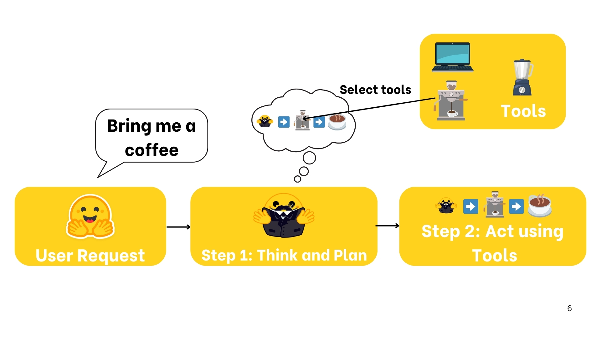
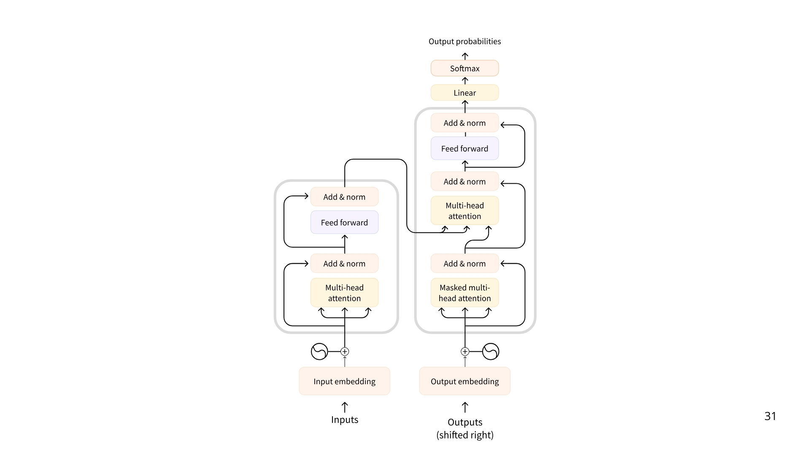

# Unit 1

## Introduction to Agents

https://huggingface.co/learn/agents-course/unit1/introduction

---


이 첫 번째 유닛에 오신 것을 환영합니다! 여기에서는 AI 에이전트의 기본 개념을 탄탄하게 다질 것입니다.

### 에이전트 이해하기
- 에이전트란 무엇이며, 어떻게 작동하는가?
- 에이전트는 추론과 계획을 통해 어떻게 결정을 내리는가?

### 에이전트에서 LLM(대형 언어 모델)의 역할
- LLM이 에이전트의 "두뇌" 역할을 하는 방식.
- LLM이 메시지 시스템을 통해 대화를 구성하는 방식.

### 도구와 액션
- 에이전트가 외부 도구를 활용하여 환경과 상호작용하는 방식.
- 에이전트를 위한 도구를 구축하고 통합하는 방법.

### 에이전트의 워크플로우
- 사고(Think) → 행동(Act) → 관찰(Observe).

이러한 주제를 탐색한 후, **smolagents**를 사용하여 첫 번째 에이전트를 구축하게 됩니다!

당신의 에이전트 **Alfred**는 간단한 작업을 수행하며, 이 개념들을 실제로 적용하는 방법을 보여줄 것입니다.

또한, **Hugging Face Spaces**에 에이전트를 배포하는 방법을 배워 친구들과 동료들에게 공유할 수도 있습니다.

마지막으로, 이 유닛이 끝나면 퀴즈를 치르게 됩니다. 통과하면 **🎓 에이전트 기본 과정 수료 인증서(Certificate of Fundamentals of Agents)**를 받게 됩니다! 🚀


이 유닛은 에이전트를 이해하기 위한 필수 출발점으로, 더 고급 주제로 나아가기 전에 기초를 탄탄히 다지는 과정입니다.

이 유닛은 내용이 많으니 천천히 학습하고, 필요할 때마다 다시 돌아와 복습해도 좋습니다.

준비됐나요? 함께 시작해봅시다! 🚀

---

## What is an Agent?


이 섹션이 끝나면, 에이전트 개념과 AI에서의 다양한 활용 방식에 대해 익숙해질 것입니다.

에이전트가 무엇인지 설명하기 위해, 비유를 들어 시작해 보겠습니다.

### 전체 개요: 에이전트 Alfred

Alfred를 소개합니다. Alfred는 에이전트입니다.


상상해보세요. Alfred가 다음과 같은 명령을 받습니다.
**"Alfred, 커피 한 잔 주세요."**


Alfred는 자연어를 이해할 수 있기 때문에 우리의 요청을 빠르게 파악합니다.

주문을 수행하기 전에, Alfred는 **추론과 계획(reasoning and planning)** 을 통해 필요한 단계와 도구를 결정합니다:

1. **주방으로 이동**
2. **커피 머신 사용**
3. **커피 추출**
4. **커피를 가져오기**


계획이 세워지면, Alfred는 행동해야 합니다. 계획을 실행하기 위해, 그는 자신이 알고 있는 **도구 목록**에서 적절한 도구를 선택하여 사용합니다.

이 경우, **커피를 만들기 위해 Alfred는 커피 머신을 사용**합니다.
그는 **커피 머신을 작동시켜 커피를 추출**합니다.


마지막으로, Alfred는 갓 추출한 커피를 우리에게 가져옵니다. ☕


이것이 바로 **에이전트(Agent)** 입니다.

에이전트는 **추론(reasoning), 계획(planning), 그리고 환경과의 상호작용(interacting with its environment)** 이 가능한 AI 모델입니다.

우리가 이것을 **에이전트(Agent)** 라고 부르는 이유는, **에이전시(agency)** 를 가지고 있기 때문입니다. 즉, **환경과 상호작용할 수 있는 능력**을 갖추고 있기 때문입니다.





### Let’s go more formal

좀 더 공식적으로 정리해봅시다

이제 전체 개념을 이해했으니, 더 정확한 정의를 살펴보겠습니다:

**에이전트(Agent)** 는 **AI 모델을 활용하여 환경과 상호작용하고, 사용자가 정의한 목표를 달성하는 시스템**입니다.
이는 **추론(reasoning), 계획(planning), 그리고 행동 실행(execution of actions, 주로 외부 도구 활용)** 을 결합하여 작업을 수행합니다.

에이전트는 두 가지 주요 부분으로 구성됩니다:

### **에이전트의 두 가지 주요 구성 요소**

1️⃣ **두뇌 (The Brain - AI 모델)**
   - 모든 **사고(thinking)** 과정이 이루어지는 부분입니다.
   - AI 모델이 **추론(reasoning)** 및 **계획(planning)** 을 담당합니다.
   - 상황에 따라 **어떤 행동(Actions)을 취할지 결정**합니다.

2️⃣ **몸 (The Body - 기능과 도구)**
   - 에이전트가 수행할 수 있는 모든 **기능과 도구(capabilities and tools)** 를 포함합니다.
   - 수행할 수 있는 행동의 범위는 **에이전트가 갖춘 도구와 기능에 따라 결정**됩니다.
   - 예를 들어, 인간에게는 **날개가 없으므로 "날기(fly)" 행동을 수행할 수 없지만**,
     대신 **"걷기(walk)", "달리기(run)", "점프하기(jump)", "잡기(grab)"** 같은 행동은 수행할 수 있습니다.

즉, **AI 모델이 사고하고 계획을 세우면, 이를 실행할 수 있는 도구와 기능이 결정된 범위 내에서 행동을 수행**하는 구조입니다. 🚀

### **에이전트에 사용되는 AI 모델 유형**

에이전트에서 가장 일반적으로 사용되는 AI 모델은 **LLM(대형 언어 모델, Large Language Model)** 입니다.

- **LLM은 텍스트를 입력받아 텍스트를 출력하는 모델**입니다.
- 대표적인 예로는 **OpenAI의 GPT-4, Meta의 LLaMA, Google의 Gemini** 등이 있습니다.
- 이러한 모델들은 방대한 양의 텍스트 데이터를 학습했으며, **일반화(generalization)** 능력이 뛰어납니다.
- 다음 섹션에서 LLM에 대해 더 자세히 알아볼 예정입니다.

### **다른 유형의 모델도 에이전트에 활용 가능**
- **에이전트의 핵심 모델**로 **다른 입력 유형을 처리할 수 있는 모델**을 사용할 수도 있습니다.
- 예를 들어, **VLM(비전-언어 모델, Vision Language Model)** 은 LLM과 유사하지만 **이미지를 입력으로 이해할 수 있는 모델**입니다.
- 하지만, 지금은 **LLM에 집중**하고, 이후에 다른 모델 옵션들을 다룰 예정입니다. 🚀

### **AI는 환경에서 어떻게 행동할까?**

LLM은 강력한 모델이지만, **기본적으로 텍스트만 생성할 수 있습니다**.

그런데 **HuggingChat**이나 **ChatGPT** 같은 챗봇에 **"이미지를 생성해줘"** 라고 요청하면, 실제로 이미지를 생성할 수 있습니다! 어떻게 이런 일이 가능할까요?

### **정답: 도구(Tools) 활용**
HuggingChat, ChatGPT 등의 애플리케이션 개발자들은 **추가 기능(Tools)을 구현하여** LLM이 이를 사용할 수 있도록 만들었습니다.

- LLM 자체는 **텍스트만 생성**하지만,
- **"이미지를 생성하는 도구"를 API 형태로 연결**하면,
- LLM은 이 도구를 활용하여 **이미지를 생성**할 수 있습니다.

이러한 방식으로 **에이전트는 외부 도구와 상호작용하며 환경에서 실제 행동을 수행할 수 있습니다**. 🚀


### **에이전트가 수행할 수 있는 작업은 무엇인가?**

에이전트는 **도구(Tools)를 통해 구현된 작업**을 수행할 수 있습니다.

예를 들어, **개인 비서 AI**를 만들고 싶다면, 이메일을 보내는 기능을 도구로 구현할 수 있습니다.
만약 사용자가 **"오늘 회의를 연기해달라고 매니저에게 이메일을 보내줘"** 라고 요청하면, 에이전트는 아래와 같이 도구를 활용할 수 있습니다:

```python
def send_message_to(recipient, message):
    """수신자에게 이메일을 보내는 기능"""
    ...
```

그리고 LLM은 필요할 때 이 도구를 실행하는 코드를 생성할 수 있습니다.

```python
send_message_to("Manager", "Can we postpone today's meeting?")
```

이처럼 **도구의 설계는 에이전트의 품질에 큰 영향을 미칩니다**.
- 어떤 작업은 **특정 목적의 맞춤형 도구**가 필요하지만,
- **웹 검색(web_search)** 같은 일반적인 도구로 해결할 수도 있습니다.

### **Actions와 Tools의 차이**
- **도구(Tools)**: 특정 작업을 수행하는 기능 (예: 이메일 보내기, 웹 검색)
- **행동(Actions)**: 여러 도구를 조합하여 수행하는 일련의 과정 (예: 회의 일정 조정 → 이메일 전송 → 캘린더 업데이트)

### **실제 사례에서의 에이전트 활용 예시**

#### **예제 1: 개인 가상 비서 (Virtual Assistants)**
- Siri, Alexa, Google Assistant 같은 가상 비서는 **사용자의 요청을 이해하고**,
- **디지털 환경에서 정보를 검색하거나**,
- **메시지 전송, 일정 설정, 스마트 기기 제어 등의 작업을 수행**합니다.

#### **예제 2: 고객 서비스 챗봇 (Customer Service Chatbots)**
- 많은 기업들이 **고객과 자연어로 소통하는 챗봇 에이전트**를 운영합니다.
- 고객의 질문에 답변하고, **문제 해결을 도와주거나, 데이터베이스에서 정보를 검색**,
- **내부 시스템에 이슈를 등록하거나, 트랜잭션을 완료**하는 등 다양한 작업을 수행할 수 있습니다.
- 이러한 에이전트는 **사용자 만족도를 높이고, 대기 시간을 줄이며, 매출을 증가시키는 역할**을 합니다.

#### **예제 3: 비디오 게임의 AI NPC (AI Non-Playable Character, NPC)**
- LLM을 활용한 AI NPC는 기존의 **고정된 행동 트리(Behavior Tree)** 대신,
- **플레이어의 상호작용에 따라 적응하며 보다 자연스러운 대화를 생성**할 수 있습니다.
- 이를 통해 **더 몰입감 있는 게임 경험을 제공**할 수 있습니다.

---

### **정리: 에이전트의 핵심 역할**
에이전트는 **AI 모델(주로 LLM)을 중심으로 동작하며**, 다음과 같은 기능을 수행합니다:

1️⃣ **자연어 이해(Natural Language Understanding)**
   - 인간의 명령을 해석하고, 의미 있는 방식으로 응답

2️⃣ **추론과 계획(Reasoning & Planning)**
   - 정보를 분석하고, 결정을 내리며, 문제를 해결하기 위한 전략을 수립

3️⃣ **환경과 상호작용(Interaction with Environment)**
   - 정보를 검색하고, 작업을 수행하며, 결과를 관찰하여 반응

---

이제 **에이전트의 개념을 확실히 이해했으므로**, 간단한 퀴즈로 복습한 후 **에이전트의 두뇌인 LLM에 대해 깊이 파고들어 보겠습니다**! 🚀

---

# What are LLMs?

이전 섹션에서는 **에이전트가 AI 모델을 필요로 하며, LLM이 가장 일반적인 선택**이라는 점을 배웠습니다.

이제 **LLM이 무엇인지, 그리고 어떻게 에이전트를 구동하는지** 살펴보겠습니다.

이 섹션에서는 **LLM의 활용을 기술적으로 간략히 설명**합니다.
더 깊이 알고 싶다면, **무료 자연어 처리(NLP) 강의**를 확인할 수도 있습니다.

### What is a Large Language Model?

**LLM(Large Language Model)** 은 **인간의 언어를 이해하고 생성하는 데 뛰어난 AI 모델**입니다.

- 방대한 **텍스트 데이터로 학습**하여, **언어의 패턴, 구조, 심지어 뉘앙스까지 학습**합니다.
- 일반적으로 **수백만~수천억 개의 파라미터**를 포함하는 거대한 모델입니다.

### **LLM의 핵심: Transformer 아키텍처**
현재 대부분의 LLM은 **Transformer 아키텍처**를 기반으로 구축됩니다.
- Transformer는 **"Attention" 알고리즘**을 활용하는 **딥러닝 모델**입니다.
- 2018년, Google이 발표한 **BERT** 모델 이후 크게 주목받기 시작했습니다.
- 이후 **GPT, LLaMA, Gemini 등 최신 LLM들도 Transformer 구조를 기반으로 동작**합니다.

👉 **LLM은 에이전트의 두뇌 역할을 하며, 자연어를 이해하고 텍스트를 생성하는 핵심 엔진으로 작동합니다.** 🚀



### **Transformer의 세 가지 유형**

#### **1️⃣ 인코더(Encoder) 기반 Transformer**
- 입력 텍스트(또는 데이터)를 **밀집된 표현(embedding)** 으로 변환
- **예제:** Google의 **BERT**
- **사용 사례:**
  - 텍스트 분류(Text Classification)
  - 의미 검색(Semantic Search)
  - 개체명 인식(NER, Named Entity Recognition)
- **모델 크기:** 수백만 개의 파라미터

---

#### **2️⃣ 디코더(Decoder) 기반 Transformer**
- **새로운 토큰을 한 번에 하나씩 생성**하여 문장을 완성하는 방식
- **예제:** Meta의 **LLaMA**
- **사용 사례:**
  - 텍스트 생성(Text Generation)
  - 챗봇(Chatbots)
  - 코드 생성(Code Generation)
- **모델 크기:** **수십억 개(10⁹)의 파라미터**

---

#### **3️⃣ Seq2Seq (Encoder-Decoder) Transformer**
- **인코더가 입력을 처리해 문맥(context) 표현을 생성한 후**,
  **디코더가 이를 바탕으로 새로운 시퀀스를 출력**
- **예제:** Google의 **T5, BART**
- **사용 사례:**
  - 기계 번역(Translation)
  - 텍스트 요약(Summarization)
  - 문장 변환(Paraphrasing)
- **모델 크기:** 수백만 개의 파라미터

---

### **대형 언어 모델(LLM)은 주로 디코더 기반**
- 다양한 형태의 Transformer 모델이 있지만, **대부분의 LLM은 디코더 기반 모델**입니다.
- LLM은 **수십억 개의 파라미터를 가지며**, 텍스트 생성 및 자연어 이해를 수행합니다.

👉 이제 가장 널리 사용되는 대표적인 LLM들을 살펴보겠습니다. 🚀

### **대표적인 LLM 모델과 제공자**

| **모델**       | **제공자** |
|---------------|-----------|
| **Deepseek-R1** | DeepSeek  |
| **GPT-4**      | OpenAI    |
| **Llama 3**    | Meta (Facebook AI Research) |
| **SmolLM2**    | Hugging Face |
| **Gemma**      | Google    |
| **Mistral**    | Mistral   |

---

### **LLM의 핵심 원리: 다음 토큰 예측 (Next Token Prediction)**

LLM의 동작 원리는 **매우 간단하지만 강력**합니다.
👉 **이전 토큰들의 시퀀스를 기반으로 다음 토큰을 예측**하는 것이 목표입니다.

#### **토큰(Token)이란?**
- **토큰은 LLM이 처리하는 기본 단위**입니다.
- 흔히 **단어(word)와 유사하지만**, LLM은 효율성을 위해 **완전한 단어가 아닌 부분 단위(sub-word units)를 사용**합니다.
- 예를 들어, 영어에는 약 **60만 개의 단어**가 있지만, **LLaMA 2의 어휘(vocabulary)는 약 32,000개의 토큰**으로 구성됩니다.
- 따라서 **하나의 단어가 여러 개의 토큰으로 나뉠 수 있음**.

#### **토큰화(Tokenization)의 예시**
다음과 같이 **하나의 단어가 여러 개의 토큰으로 분할**될 수 있습니다:

- `"interest"` + `"ing"` → `"interesting"`
- `"interest"` + `"ed"` → `"interested"`

이러한 방식으로 **효율적인 텍스트 처리가 가능**하며, LLM은 보다 정교한 단어 생성을 수행할 수 있습니다.

👉 **인터랙티브 플레이그라운드에서 다양한 토크나이저(Tokenizers)를 실험**하며 직접 확인해볼 수도 있습니다! 🚀

### **LLM의 특수 토큰(Special Tokens)**

각 LLM은 **고유한 특수 토큰(Special Tokens)** 을 사용합니다.
- **특수 토큰은 모델이 생성하는 구조를 열고 닫는 역할**을 합니다.
- 예를 들어, **시퀀스의 시작/종료, 메시지의 시작/종료, 응답의 끝** 등을 나타낼 수 있습니다.
- 특히 중요한 토큰 중 하나는 **EOS(End of Sequence) 토큰**, 즉 **문장이나 메시지가 끝났음을 표시하는 토큰**입니다.

---

### **모델별 EOS 토큰 비교**

| **모델**       | **제공자** | **EOS 토큰**           | **기능** |
|---------------|-----------|----------------------|----------|
| **GPT-4**     | OpenAI    | `<\|endoftext\|>`       | 메시지 종료 |
| **Llama 3**   | Meta (Facebook AI Research) | `<\|eot_id\|>`  | 시퀀스 종료 |
| **Deepseek-R1** | DeepSeek  | `<\|end_of_sentence\|>` | 메시지 종료 |
| **SmolLM2**   | Hugging Face | `<\|im_end\|>`        | 명령어 또는 메시지 종료 |
| **Gemma**     | Google    | `<end_of_turn>`      | 대화 차례 종료 |

---

### **특수 토큰이 중요한 이유**
✅ **LLM이 문장이나 메시지의 경계를 이해**하는 데 필수적

✅ **입력 프롬프트도 특수 토큰을 포함하여 구조화**됨

✅ **각 모델마다 특수 토큰의 형태와 역할이 다름**, 따라서 **모델별로 프롬프트 엔지니어링이 필요**함


---
우리는 여러분이 **이러한 특수 토큰을 외울 필요는 없지만**,

✅ **모델마다 특수 토큰이 다양하다는 점**

✅ **이 토큰들이 LLM의 텍스트 생성 과정에서 중요한 역할을 한다는 점**
을 이해하는 것이 중요합니다.

더 자세히 알고 싶다면, **모델의 Hub 저장소**에서 설정 파일을 확인할 수 있습니다.
예를 들어, **SmolLM2 모델의 특수 토큰은 `tokenizer_config.json` 파일에서 확인 가능**합니다.

👉 **각 LLM의 특수 토큰이 어떻게 정의되는지 직접 살펴보고 싶다면, 해당 모델의 Hugging Face Hub에서 확인해 보세요! 🚀**


👉 **이제, LLM이 이러한 원리를 활용하여 어떻게 에이전트를 구동하는지 살펴보겠습니다! 🚀**


### **다음 토큰 예측(Next Token Prediction) 이해하기**

LLM은 **자기회귀(Autoregressive) 모델**입니다.

✅ 즉, **이전 단계의 출력을 다음 단계의 입력으로 사용하는 방식**으로 동작합니다.

### **토큰 생성 과정**
1. **초기 입력(prompt) 제공**
   - 사용자가 "Tell me a joke."(농담 하나 알려줘)라는 프롬프트를 입력.
2. **첫 번째 토큰 예측**
   - 모델은 주어진 프롬프트를 기반으로 **다음에 올 가능성이 가장 높은 토큰을 예측**.
3. **출력된 토큰을 입력으로 추가**
   - 예측된 토큰이 다음 입력으로 추가되고, 이를 바탕으로 **다음 토큰을 생성**.
4. **이 과정을 반복**
   - 모델이 **EOS(End of Sequence) 토큰**을 예측할 때까지 루프 진행.
5. **생성 종료**
   - **EOS 토큰이 나오면 모델이 멈추고**, 최종적인 문장이 출력됨.

---

### **LLM의 자기회귀(Autoregressive) 예시**

**입력(prompt):**

`"Tell me a joke."`

**토큰 예측 과정:**

1️⃣ `"Why"`

2️⃣ `" did"`

3️⃣ `" the"`

4️⃣ `" chicken"`

5️⃣ `" cross"`

6️⃣ `" the"`

7️⃣ `" road?"`

8️⃣ `"<|eos|>"` → 생성 종료 🚀

---

### **핵심 요점**
✔ **LLM은 한 번에 하나의 토큰만 예측하며, 이전 출력을 새로운 입력으로 활용**

✔ **EOS 토큰이 등장하면 모델이 멈추고 최종 결과를 반환**

✔ **이러한 방식으로 LLM은 자연스럽고 일관된 텍스트를 생성 가능**


### **LLM의 디코딩 과정: 한 번의 루프에서 무슨 일이 벌어질까?**

LLM은 **EOS(End of Sequence) 토큰이 나올 때까지 텍스트를 디코딩**합니다.
그렇다면 **한 번의 디코딩 루프에서 어떤 일이 일어날까요?**

---

### **디코딩 과정의 개요**
#### **1️⃣ 입력 텍스트 토크나이징 (Tokenization)**
- 입력된 텍스트가 **토큰으로 변환**됨.
- 예: `"Hello world!"` → `["Hello", " world", "!"]`

#### **2️⃣ 입력 시퀀스의 의미와 위치 정보 계산**
- 모델은 각 토큰의 **의미(semantic representation)와 위치 정보(positional encoding)** 를 포함한 표현을 생성.
- 이는 문맥(Context)을 이해하는 데 필수적.

#### **3️⃣ 다음 토큰 예측을 위한 확률 점수 계산**
- 모델은 어휘(vocabulary) 내 모든 토큰에 대해 **다음 토큰이 될 확률을 계산**.
- 예를 들어, `"Hello world"` 다음에 나올 가능성이 높은 단어를 예측하는 경우:
  - `"!"` → 85%
  - `"?"` → 10%
  - `" is"` → 5%
- 가장 확률이 높은 토큰을 선택하여 출력.

---

### **한 줄 요약**

✅ **입력 → 토크나이징 → 의미 및 위치 정보 계산 → 다음 토큰 확률 예측 → 출력**

✅ 이 과정을 **EOS 토큰이 나올 때까지 반복**, 텍스트가 자연스럽게 이어짐.


### **다음 토큰을 선택하는 다양한 디코딩 전략**

LLM이 다음 토큰의 확률 점수를 계산한 후, 이를 바탕으로 여러 **디코딩 전략**을 사용할 수 있습니다.

---

### **1️⃣ 가장 단순한 전략: Argmax Decoding (Greedy Decoding)**
- **항상 가장 높은 확률(최대 점수)의 토큰을 선택**.
- 예:
  - `"Hello"` → `"world"` (90%)
  - `"world"` → `"!"` (95%)
- **장점:** 계산이 빠르고 예측이 직관적.
- **단점:** **창의성이 부족**하며, 항상 같은 출력을 생성(다양성이 없음).

---

### **2️⃣ 다양한 디코딩 전략 실험하기**
👉 **SmolLM2 모델이 있는 Hugging Face Space에서 직접 디코딩 과정을 실험해볼 수 있습니다!**
- SmolLM2는 **EOS 토큰 `<|im_end|>`** 를 만날 때까지 텍스트를 디코딩합니다.
- 다양한 전략을 사용하여 출력을 어떻게 조절할 수 있는지 실험해볼 수 있습니다.

---

### **다음 단계: 더 발전된 디코딩 기법**
이제 **Greedy Decoding 이외에도**

✅ **샘플링(Sampling)**

✅ **탑-K 샘플링(Top-K Sampling)**

✅ **탑-P(누클리어스) 샘플링(Top-P, Nucleus Sampling)**

✅ **빔 서치(Beam Search)**

### **더 발전된 디코딩 전략**

LLM의 출력 품질을 향상시키기 위해 **더 정교한 디코딩 기법**이 사용됩니다.
그중 하나가 **Beam Search(빔 서치)** 입니다.

---

### **1️⃣ Beam Search: 다중 후보 탐색**
- **여러 개의 후보 시퀀스를 동시에 탐색하여 전체 점수가 가장 높은 문장을 선택**
- 개별 토큰의 점수가 낮더라도 **전체적으로 더 자연스럽고 일관된 문장을 생성할 가능성이 높음**

✅ **Greedy Decoding(탐욕적 선택)과 비교하면?**
- Greedy Decoding은 **항상 즉시 가장 높은 점수의 토큰을 선택** → 최적의 문장을 놓칠 가능성이 있음
- Beam Search는 **여러 개의 후보 문장을 고려**하여 더 나은 결과를 찾음

---

### **더 다양한 디코딩 전략이 존재!**
- **샘플링(Sampling)**: 확률적으로 토큰을 선택해 다양성을 증가
- **Top-K 샘플링**: 확률이 높은 **K개의 후보 중 랜덤 샘플링**
- **Top-P(누클리어스) 샘플링**: 누적 확률이 P%를 초과하는 후보 중 선택
- **혼합 전략 (Beam Search + Sampling)**: 창의성과 일관성을 조합

👉 더 깊이 알고 싶다면, **Hugging Face NLP 강의를 참고해보세요!** 🚀

### **"Attention is all you need" – Transformer의 핵심: 어텐션(Attention)**

Transformer 아키텍처에서 가장 중요한 요소 중 하나는 **어텐션(Attention)** 입니다.
👉 **다음 단어(토큰)를 예측할 때, 모든 단어가 동일한 중요도를 가지는 것은 아닙니다.**

예를 들어,
> `"The capital of France is ..."`
이 문장에서 **"France"** 와 **"capital"** 이 가장 중요한 의미를 가지며,
다음 단어를 예측할 때 더 높은 가중치를 받게 됩니다.

---

### **어텐션(Attention) 메커니즘의 역할**
- **가장 관련성이 높은 단어에 집중하여 가중치를 부여**
- 문장의 **장거리 의존성(Long-range dependency)을 효과적으로 처리**
- **다음 토큰을 더 정확하게 예측**할 수 있도록 도움

**💡 어텐션이 LLM의 핵심 기능인 "다음 토큰 예측"을 극도로 효과적으로 만드는 요소입니다.**

---

### **LLM의 발전: 더 긴 문맥(Context Length) 처리**
- GPT-2 이후, **기본적인 "다음 토큰 예측" 원리는 유지되었지만**,
  **신경망을 확장하고 어텐션 메커니즘을 최적화하는 연구가 지속됨**.
- 특히, LLM의 **문맥 길이(Context Length)** 를 증가시키는 것이 주요 연구 방향 중 하나.
  - 문맥 길이가 길수록, **더 많은 정보를 고려하여 자연스럽고 일관된 응답을 생성**할 수 있음.
  - 예를 들어, GPT-4 Turbo는 **128K 토큰**까지 처리 가능.

---

### **💡 정리: 어텐션의 역할과 문맥 길이(Context Length)**
✅ 어텐션은 **중요한 단어에 집중하여 모델의 예측력을 향상**

✅ **LLM의 문맥 길이**는 모델이 한 번에 처리할 수 있는 최대 토큰 수

✅ 문맥 길이가 길수록 **더 많은 정보를 활용하여 더욱 일관된 답변 생성 가능**

👉 이제, **어텐션이 어떻게 에이전트의 추론(Reasoning)과 의사결정(Decision-making)에 영향을 미치는지 살펴보겠습니다! 🚀**

### **프롬프트(Prompting) 설계의 중요성**

LLM의 유일한 역할은 **입력된 토큰을 기반으로 다음 토큰을 예측하는 것**입니다.

👉 **어떤 토큰이 중요한지 판단하는 과정에서, 입력 문장의 구조와 표현 방식이 결정적인 영향을 미칩니다.**


✅ **LLM이 원하는 방식으로 응답하도록 하려면, 프롬프트 설계를 신중하게 해야 함.**

✅ **잘 설계된 프롬프트는 LLM이 더 정확하고 일관된 출력을 생성하도록 유도**할 수 있음.

---

## **LLM은 어떻게 훈련될까?**

LLM은 **대량의 텍스트 데이터**를 학습하며,
다음 단어를 예측하는 방식으로 **자기지도 학습(Self-supervised learning) 또는 마스킹된 언어 모델링(Masked Language Modeling, MLM) 방식**을 사용합니다.

- **비지도 학습(Unsupervised Learning)** 을 통해 언어의 구조와 패턴을 학습
- 이를 통해 **새로운(보지 못한) 데이터에도 일반화(Generalization) 가능**

### **LLM 훈련 과정**
1️⃣ **사전 학습(Pre-training)**:
   - 방대한 텍스트 데이터에서 **패턴과 문법을 학습**
   - 예: GPT, LLaMA 등은 **다음 단어 예측**을 수행
   - BERT는 **마스킹된 단어 복원(Masked Token Prediction)** 방식

2️⃣ **미세 조정(Fine-tuning)**:
   - 특정 작업(예: 대화형 AI, 코드 생성, 텍스트 분류)에 맞춰 추가 학습
   - 예:
     - ChatGPT는 **대화 구조에 최적화**
     - Codex는 **코드 생성 및 이해**
     - Bard, Claude 등은 **도구 사용과 상호작용에 특화**

---

## **LLM을 활용하는 방법**

LLM을 사용할 때 **두 가지 주요 옵션**이 있습니다:

1️⃣ **로컬 실행 (Run Locally)**
   - 충분한 **하드웨어(GPU, RAM 등)** 가 필요
   - 오픈소스 모델(Llama 3, Mistral 등)을 다운로드하여 실행 가능

2️⃣ **클라우드/API 사용 (Cloud/API)**
   - **Hugging Face Inference API** 같은 클라우드 기반 서비스 활용
   - 로컬에서 강력한 하드웨어가 필요하지 않음
   - 빠른 배포 가능

💡 **이 과정에서는 주로 Hugging Face Hub의 API를 통해 모델을 활용**할 예정입니다.
하지만 이후에는 **로컬 환경에서 직접 실행하는 방법도 다룰 예정**입니다. 🚀

---

## **LLM이 AI 에이전트에서 수행하는 역할**

LLM은 **AI 에이전트의 핵심 컴포넌트**입니다.
✔ **자연어 이해 및 생성**
✔ **사용자 지시 해석**
✔ **대화 맥락 유지**
✔ **계획 수립 및 실행 도구 선택**

**👉 LLM은 에이전트의 두뇌(Brain) 역할을 하며, 에이전트가 효과적으로 작동하도록 하는 핵심 요소입니다.**

이제 LLM이 **에이전트의 추론(Reasoning), 의사결정(Decision-making), 행동(Action-taking) 과정에서 어떻게 활용되는지** 깊이 탐구해 보겠습니다! 🚀

우리는 이제 **LLM의 기본 개념, 작동 방식, 그리고 AI 에이전트에서의 역할**을 살펴보았습니다! 🚀

💡 **더 깊이 탐구하고 싶다면?**
👉 **무료 NLP 과정**을 참고하여 언어 모델과 자연어 처리에 대한 이해를 확장할 수 있습니다.

---

## **다음 단계: LLM이 대화에서 출력을 구조화하는 방법**
이제 LLM이 **대화형 문맥에서 어떻게 응답을 생성하는지** 살펴볼 차례입니다.

### **노트북 실행을 위한 준비 사항**

✅ **Hugging Face 토큰** 필요 → [토큰 발급](https://hf.co/settings/tokens)

✅ **Jupyter Notebook 실행 방법 확인** → Hugging Face Hub에서 가이드 참고

✅ **Meta LLaMA 모델 액세스 요청 필요**

---

### **다음 과정에서 배울 내용**
- LLM이 **대화를 구성하는 방식**
- 메시지 시스템(Message System) 이해
- 대화 흐름을 유지하는 메커니즘

이제 LLM이 **에이전트와 함께 대화를 구성하는 방식**을 탐구해봅시다! 🚀
