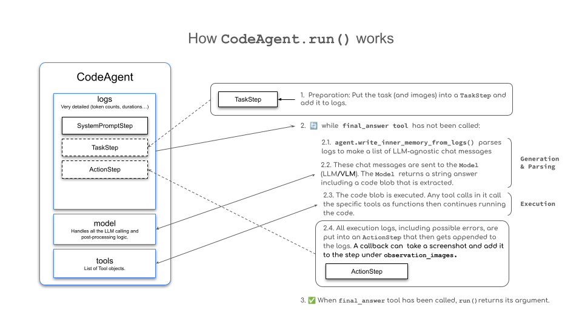
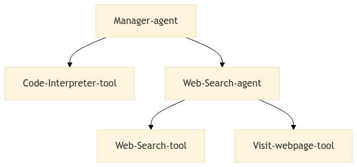
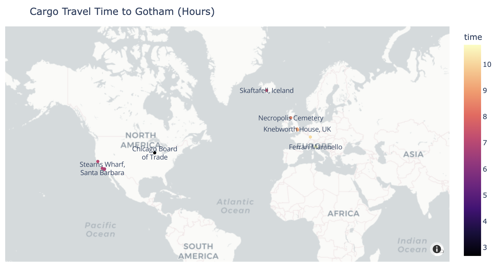

## Introduction to smolagents

1️⃣ 왜 smolagents를 사용할까
smolagents는 애플리케이션 개발을 위한 많은 오픈소스 에이전트 프레임워크 중 하나입니다. 다른 대안으로는 이 강의의 다른 모듈에서 다루는 LlamaIndex와 LangGraph가 있습니다. smolagents는 특정 사용 사례에 적합할 수 있는 여러 핵심 기능을 제공하지만, 프레임워크를 선택할 때는 항상 모든 옵션을 고려해야 합니다. 우리는 smolagents를 사용할 때의 장점과 단점을 살펴보고, 프로젝트 요구사항에 따라 정보에 입각한 결정을 내릴 수 있도록 도와줄 것입니다.

2️⃣ CodeAgents
CodeAgents는 smolagents에서 기본이 되는 에이전트 유형입니다. JSON이나 텍스트를 생성하는 대신, 이러한 에이전트는 작업을 수행하기 위해 Python 코드를 생성합니다. 이 모듈에서는 CodeAgents의 목적, 기능, 작동 방식뿐만 아니라 이들의 능력을 보여주는 실습 예제도 다룹니다.

3️⃣ ToolCallingAgents
ToolCallingAgents는 smolagents에서 지원되는 두 번째 유형의 에이전트입니다. Python 코드를 생성하는 CodeAgents와는 달리, 이러한 에이전트는 시스템이 분석하고 해석하여 동작을 수행해야 하는 JSON/텍스트 블롭에 의존합니다. 이 모듈은 그들의 기능, CodeAgents와의 주요 차이점, 그리고 사용법을 보여주는 예제를 제공합니다.

4️⃣ 도구들
Unit 1에서 보았듯이, 도구는 에이전트 시스템 내에서 LLM이 사용할 수 있는 함수이며, 에이전트 행동의 필수적인 구성 요소 역할을 합니다. 이 모듈에서는 도구를 만드는 방법, 그 구조, Tool 클래스나 @tool 데코레이터를 활용한 다양한 구현 방법을 다룹니다. 또한 기본 제공 도구 상자, 커뮤니티와 도구를 공유하는 방법, 커뮤니티 기여 도구를 로드하여 자신의 에이전트에서 사용하는 방법도 배우게 됩니다.

5️⃣ 검색 에이전트 (Retrieval Agents)
검색 에이전트는 모델이 지식 베이스에 접근할 수 있게 하여, 여러 소스로부터 정보를 검색하고, 종합하며, 추출할 수 있도록 합니다. 이들은 벡터 스토어를 활용하여 효율적인 검색을 수행하고, RAG(Retrieval-Augmented Generation) 패턴을 구현합니다. 이러한 에이전트는 웹 검색과 사용자 정의 지식 베이스를 통합하면서도 메모리 시스템을 통해 대화의 맥락을 유지하는 데 특히 유용합니다. 이 모듈에서는 강건한 정보 검색을 위한 폴백(fallback) 메커니즘을 포함한 구현 전략을 다룹니다.

6️⃣ 멀티 에이전트 시스템 (Multi-Agent Systems)
강력한 멀티 에이전트 시스템을 구축하려면 여러 에이전트를 효과적으로 조율하는 것이 중요합니다. 예를 들어, 웹 검색 에이전트와 코드 실행 에이전트를 결합하면 더 정교한 솔루션을 만들 수 있습니다. 이 모듈은 멀티 에이전트 시스템을 효율적이고 안정적으로 설계, 구현, 관리하는 데 초점을 맞춥니다.

7️⃣ 비전 및 브라우저 에이전트 (Vision and Browser Agents)
비전 에이전트는 Vision-Language Model(VLM)을 통합하여 기존 에이전트의 기능을 확장하며, 시각 정보를 처리하고 해석할 수 있게 합니다. 이 모듈에서는 이미지 기반 추론, 시각적 데이터 분석, 멀티모달 상호작용과 같은 고급 기능을 가능하게 하는 VLM 기반 에이전트의 설계 및 통합 방법을 다룹니다. 또한, 비전 에이전트를 활용하여 웹을 탐색하고 정보를 추출할 수 있는 브라우저 에이전트를 구축합니다.

## 왜 smolagents를 사용할까
이 모듈에서는 smolagents를 사용할 때의 장단점을 살펴보고, 이 프레임워크가 여러분의 요구에 적합한지에 대한 정보에 입각한 결정을 내릴 수 있도록 도와줄 것입니다.

### smolagents란?

smolagents는 간단하지만 강력한 AI 에이전트 구축 프레임워크입니다. 이 프레임워크는 LLM이 검색하거나 이미지를 생성하는 등의 방식으로 실제 세계와 상호작용할 수 있는 능력을 제공합니다.

Unit 1에서 배운 것처럼, AI 에이전트는 ’관찰(observations)’을 바탕으로 ’생각(thoughts)’을 생성하고 이를 바탕으로 ’행동(actions)’을 수행하는 프로그램입니다. 이제 이것이 smolagents에서 어떻게 구현되는지 살펴보겠습니다.

smolagents의 주요 장점
- 단순함: 코드 복잡도와 추상화가 최소화되어 프레임워크를 이해하고 채택하며 확장하기 쉬움
- 유연한 LLM 지원: Hugging Face 도구와 외부 API와의 통합을 통해 어떤 LLM과도 작동 가능
- 코드 우선 접근 방식: 에이전트가 직접 코드로 동작을 작성할 수 있도록 하는 Code Agent에 대한 일급 지원으로, 파싱이 필요 없고 도구 호출이 간단해짐
- HF Hub 통합: Hugging Face Hub와의 원활한 통합을 통해 Gradio Spaces를 도구로 활용 가능

언제 smolagents를 사용할까?
이러한 장점을 고려할 때, 다른 프레임워크 대신 smolagents를 사용해야 하는 상황은 다음과 같습니다:
- 가볍고 최소한의 솔루션이 필요한 경우
- 복잡한 설정 없이 빠르게 실험하고 싶은 경우
- 애플리케이션 로직이 단순한 경우


### 코드 vs. JSON 액션

다른 프레임워크에서는 에이전트가 작업을 JSON 형식으로 작성하는 경우가 많은 반면, smolagents는 코드 기반의 도구 호출에 초점을 맞추어 실행 과정을 단순화합니다.

이는 도구를 호출하는 코드를 생성하기 위해 JSON을 파싱할 필요가 없기 때문이며, 출력 결과를 바로 실행할 수 있습니다.

다음 다이어그램은 이러한 차이를 보여줍니다:


### smolagents의 에이전트 유형

smolagents의 에이전트는 다단계(Multi-step) 에이전트로 작동합니다.

각 MultiStepAgent는 다음을 수행합니다:
- 하나의 thought 생성
- 하나의 도구 호출 및 실행

기본 에이전트 유형으로 CodeAgent를 사용하는 것 외에도, smolagents는 도구 호출을 JSON 형식으로 작성하는 ToolCallingAgent도 지원합니다.

각 에이전트 유형에 대해서는 다음 섹션에서 더 자세히 살펴보겠습니다.

smolagents에서는 도구를 Python 함수에 @tool 데코레이터를 씌우거나 Tool 클래스를 사용하여 정의합니다.

⸻

### smolagents에서의 모델 통합

smolagents는 유연한 LLM 통합을 지원하며, 특정 기준을 충족하는 모든 callable 모델을 사용할 수 있습니다. 프레임워크는 모델 연결을 간소화하기 위한 여러 가지 미리 정의된 클래스를 제공합니다:
- TransformersModel: 로컬 transformers 파이프라인을 구현하여 원활한 통합 지원
- HfApiModel: Hugging Face 인프라 또는 다양한 서드파티 추론 서비스와 연동되는 서버리스 추론 지원
- LiteLLMModel: LiteLLM을 활용하여 경량화된 모델 상호작용 제공
- OpenAIServerModel: OpenAI API 인터페이스를 제공하는 모든 서비스와 연결 가능
- AzureOpenAIServerModel: Azure OpenAI 배포와의 통합을 지원

이러한 유연성 덕분에 개발자는 특정 사용 사례에 가장 적합한 모델과 서비스를 선택할 수 있으며, 실험도 쉽게 진행할 수 있습니다.

이제 smolagents를 언제 왜 사용하는지 이해했으니, 이 강력한 라이브러리를 더 깊이 살펴보도록 합시다!

## Building Agents That Use Code

Code Agent는 smolagents에서 기본 에이전트 유형입니다. 이들은 작업을 수행하기 위해 Python 도구 호출을 생성하며, 효율적이고 표현력이 뛰어나며 정확한 작업 표현을 가능하게 합니다.

이러한 간결한 접근 방식은 필요한 작업 수를 줄이고, 복잡한 연산을 단순화하며, 기존 코드 함수의 재사용을 가능하게 합니다. smolagents는 약 1,000줄 정도의 코드로 구현된 경량 프레임워크를 통해 Code Agent를 구축할 수 있도록 지원합니다.

## 왜 Code Agent인가?
다단계 에이전트 프로세스에서는 LLM이 작업을 작성하고 실행하며, 이 작업에는 일반적으로 외부 도구 호출이 포함됩니다. 전통적인 방식에서는 도구 이름과 인자를 문자열로 명시한 JSON 형식을 사용하고, 시스템이 이를 파싱하여 어떤 도구를 실행할지 결정해야 합니다.

하지만 연구에 따르면, LLM은 코드를 직접 사용하는 방식에서 도구 호출을 더 효과적으로 수행할 수 있습니다. 이는 smolagents의 핵심 원칙 중 하나이며, 이는 Executable Code Actions Elicit Better LLM Agents 논문에 나온 위 다이어그램에서 확인할 수 있습니다.

https://huggingface.co/papers/2402.01030


작업을 JSON이 아닌 코드로 작성하는 것은 다음과 같은 주요 장점을 제공합니다:
- 조합 가능성 (Composability): 작업을 쉽게 결합하고 재사용할 수 있음
- 객체 관리 (Object Management): 이미지와 같은 복잡한 구조를 직접 다룰 수 있음
- 범용성 (Generality): 계산적으로 가능한 어떤 작업이든 표현 가능
- LLM 친화성 (Natural for LLMs): 고품질의 코드가 이미 LLM의 학습 데이터에 풍부하게 포함되어 있음

## How Does a Code Agent Work?



위 다이어그램은 CodeAgent.run()이 어떻게 작동하는지를 보여주며, 이는 Unit 1에서 언급했던 ReAct 프레임워크를 따릅니다.
smolagents에서 에이전트를 위한 주요 추상화는 MultiStepAgent이며, 이는 핵심 구성 요소 역할을 합니다. CodeAgent는 특별한 종류의 MultiStepAgent로, 아래 예제에서 더 자세히 살펴보게 됩니다.

⸻

### CodeAgent의 작동 흐름

CodeAgent는 일련의 단계들을 반복하면서 작업을 수행하며, 기존 변수와 지식은 에이전트의 컨텍스트에 통합되고 이 정보는 execution log에 저장됩니다.
1.	SystemPromptStep에는 시스템 프롬프트가 저장되고, TaskStep에는 사용자의 쿼리가 기록됩니다.
2.	그 후 다음과 같은 while 루프가 실행됩니다:
    2.1 agent.write_memory_to_messages() 메서드는 에이전트의 로그를 LLM이 읽을 수 있는 채팅 메시지 리스트로 변환합니다.
    2.2 이 메시지들은 모델로 전송되고, 모델은 응답(completion)을 생성합니다.
    2.3 이 응답에서 작업이 파싱되며, CodeAgent의 경우 이는 코드 스니펫이어야 합니다.
    2.4 이 코드가 실행됩니다.
    2.5 실행 결과는 메모리에 ActionStep으로 기록됩니다.
3.	각 단계의 끝에서, 만약 agent.step_callback에 함수 호출이 포함되어 있다면, 그것도 실행됩니다.

⸻

이 구조를 통해 CodeAgent는 명확한 맥락 기반 추론과 도구 실행을 가능하게 하며, 다단계의 사고-행동 루프를 통해 복잡한 문제를 효과적으로 해결할 수 있습니다.

### 에이전트 내부에서 Python 모듈 임포트하기
이제 플레이리스트와 메뉴는 준비되었지만, 한 가지 중요한 요소를 더 확인해야 합니다: 조리 시간입니다!

Alfred는 지금 준비를 시작한다고 했을 때, 모든 것이 언제 준비될지를 계산해야 합니다. 만약 시간이 부족하다면 다른 슈퍼히어로들의 도움이 필요할 수도 있기 때문이죠.

⸻

smolagents는 Python 코드 스니펫을 작성하고 실행하는 데 특화된 에이전트 프레임워크이며, 보안을 위한 샌드박스 실행 환경을 제공합니다.
- 코드 실행에는 엄격한 보안 조치가 적용되며, 사전에 정의된 안전한 목록(safe list)에 없는 모듈은 기본적으로 임포트가 차단됩니다.
- 하지만 additional_authorized_imports에 문자열 형태로 모듈 이름을 전달하면 추가적인 임포트를 허용할 수 있습니다.
- 보안이 적용된 코드 실행에 대한 자세한 내용은 공식 가이드에서 확인할 수 있습니다.


```python
from smolagents import CodeAgent, HfApiModel
import numpy as np
import time
import datetime

agent = CodeAgent(tools=[], model=HfApiModel(), additional_authorized_imports=['datetime'])

agent.run(
    """
    Alfred needs to prepare for the party. Here are the tasks:
    1. Prepare the drinks - 30 minutes
    2. Decorate the mansion - 60 minutes
    3. Set up the menu - 45 minutes
    4. Prepare the music and playlist - 45 minutes

    If we start right now, at what time will the party be ready?
    """
)
```

이 예제들은 Code Agent를 활용해 할 수 있는 일들의 시작에 불과하며, 지금까지 살펴본 것만으로도 파티 준비에서 그 유용성이 드러나기 시작했습니다. Code Agent를 구축하는 방법에 대해 더 알고 싶다면 smolagents 문서를 참고하세요.

요약하자면, smolagents는 Python 코드 스니펫을 작성하고 실행하는 에이전트에 특화된 프레임워크로, 보안을 위한 샌드박스 실행 환경을 제공합니다. 또한 로컬 및 API 기반 언어 모델 모두를 지원하여 다양한 개발 환경에 유연하게 적용할 수 있습니다.

우리만의 맞춤형 파티 준비 에이전트를 Hub에 공유하기
우리의 Alfred 에이전트를 커뮤니티와 공유할 수 있다면 정말 멋지지 않을까요? 그렇게 하면 누구나 쉽게 이 에이전트를 Hub에서 다운로드해 사용할 수 있고, 고담 최고의 파티 플래너를 손쉽게 활용할 수 있게 됩니다! 자, 이제 직접 해봅시다! 🎉

⸻

smolagents 라이브러리는 커뮤니티와 완성된 에이전트를 공유하고, 다른 사람들이 만든 에이전트를 즉시 다운로드해 사용할 수 있게 해줍니다.

방법도 아주 간단합니다. 아래와 같이 하면 됩니다:

agent.push_to_hub("your-username/alfred-party-agent")

이렇게 하면 여러분의 맞춤형 에이전트가 Hugging Face Hub에 업로드되고, 다른 사람들은 아래와 같이 간단히 로드할 수 있습니다:

agent = CodeAgent.from_hub("your-username/alfred-party-agent")


⸻

이제 Alfred는 여러분만의 도우미가 아니라, 전 세계 누구나 사용할 수 있는 파티 준비 마스터가 됩니다! 🦸‍♂️🎂🪩


파티 준비 에이전트를 OpenTelemetry와 Langfuse로 살펴보기 📡
Alfred는 Party Preparator Agent를 조정하는 과정에서 디버깅에 점점 지쳐가고 있습니다. 에이전트는 본질적으로 예측 불가능하며, 동작을 추적하기도 어렵기 때문입니다. 하지만 그는 이 에이전트를 프로덕션에 배포하고자 하므로, 미래의 모니터링과 분석을 위한 강력한 추적 기능이 필요합니다.

여기서도 smolagents가 해결책이 됩니다!
smolagents는 에이전트 실행을 계측하기 위해 OpenTelemetry 표준을 지원하며, 이를 통해 실행을 쉽게 추적하고 로그를 기록할 수 있습니다. Langfuse와 SmolagentsInstrumentor의 도움으로, Alfred는 자신의 에이전트 동작을 간편하게 추적하고 분석할 수 있습니다.

⸻

설정은 아주 간단합니다!

✅ 먼저 필요한 의존성을 설치합니다:

pip install opentelemetry-sdk opentelemetry-exporter-otlp openinference-instrumentation-smolagents

✅ Alfred는 이미 Langfuse 계정을 만들고 API 키를 확보한 상태입니다. 아직 계정이 없다면 Langfuse Cloud에서 가입하거나 다른 대안을 탐색할 수 있습니다.

✅ API 키를 환경 변수로 설정합니다:
```python
import os
import base64

LANGFUSE_PUBLIC_KEY = "pk-lf-..."
LANGFUSE_SECRET_KEY = "sk-lf-..."
LANGFUSE_AUTH = base64.b64encode(f"{LANGFUSE_PUBLIC_KEY}:{LANGFUSE_SECRET_KEY}".encode()).decode()

os.environ["OTEL_EXPORTER_OTLP_ENDPOINT"] = "https://cloud.langfuse.com/api/public/otel"  # EU 리전
# os.environ["OTEL_EXPORTER_OTLP_ENDPOINT"] = "https://us.cloud.langfuse.com/api/public/otel"  # 미국 리전
os.environ["OTEL_EXPORTER_OTLP_HEADERS"] = f"Authorization=Basic {LANGFUSE_AUTH}"

✅ 이제 Alfred는 SmolagentsInstrumentor를 초기화하여 추적을 시작할 수 있습니다:

from opentelemetry.sdk.trace import TracerProvider
from openinference.instrumentation.smolagents import SmolagentsInstrumentor
from opentelemetry.exporter.otlp.proto.http.trace_exporter import OTLPSpanExporter
from opentelemetry.sdk.trace.export import SimpleSpanProcessor

trace_provider = TracerProvider()
trace_provider.add_span_processor(SimpleSpanProcessor(OTLPSpanExporter()))

SmolagentsInstrumentor().instrument(tracer_provider=trace_provider)
```

⸻

이제 Alfred는 Langfuse와 연결 완료 🔌
smolagents에서 발생하는 실행 로그는 Langfuse에 기록되며, 에이전트의 동작을 완전히 파악할 수 있습니다. Alfred는 이전 실행을 검토하고 에이전트를 더욱 정교하게 다듬을 수 있게 되었습니다.
```python
from smolagents import CodeAgent, HfApiModel

agent = CodeAgent(tools=[], model=HfApiModel())
alfred_agent = agent.from_hub('sergiopaniego/AlfredAgent', trust_remote_code=True)

alfred_agent.run("Give me the best playlist for a party at Wayne's mansion. The party idea is a 'villain masquerade' theme")
```
Alfred는 실행된 결과를 Langfuse 대시보드에서 열람하고 분석할 수 있습니다.

사실, 이 실행 중 작은 오류가 발생했지만, 에이전트는 여전히 유효한 응답을 반환했습니다.
👉 오류를 로그에서 찾아보세요. 에이전트가 그 상황을 어떻게 처리했는지 추적해 보세요.
직접 확인하고 싶다면 오류 링크도 있습니다. 물론 지금은 오류가 수정되었으며, 자세한 내용은 해당 issue에서 확인할 수 있습니다.

⸻

🎶 그 와중에 제안된 플레이리스트는 파티 준비에 완벽한 분위기를 더해줍니다. 멋지죠?

⸻

이제 첫 번째 Code Agent를 만들었으니, 다음은 Tool Calling Agent, smolagents에서 제공하는 두 번째 유형의 에이전트를 배워봅시다.

## 코드 스니펫 또는 JSON 블롭으로 작업 작성하기


`Tool Calling Agents`는 smolagents에서 제공하는 두 번째 유형의 에이전트입니다.

Python 코드 스니펫을 사용하는 Code Agent와 달리, 이 에이전트는 LLM 제공자의 내장된 도구 호출 기능을 활용하여 도구 호출을 JSON 구조로 생성합니다.

이 방식은 OpenAI, Anthropic, 기타 여러 제공자들이 사용하는 표준 방식입니다.

⸻

예를 들어, Alfred가 케이터링 서비스와 파티 아이디어를 검색하고자 할 때:

✅ CodeAgent는 다음과 같은 Python 코드를 생성하고 실행합니다:
```python
for query in [
    "Best catering services in Gotham City",
    "Party theme ideas for superheroes"
]:
    print(web_search(f"Search for: {query}"))
```
✅ 반면, ToolCallingAgent는 다음과 같은 JSON 구조를 생성합니다:
```json
[
    {"name": "web_search", "arguments": "Best catering services in Gotham City"},
    {"name": "web_search", "arguments": "Party theme ideas for superheroes"}
]
```

이 JSON 블롭은 도구 호출을 실행하는 데 사용됩니다.

⸻

smolagents는 `CodeAgent`에 중점을 두고 있지만, `ToolCallingAgent`는 변수 처리나 복잡한 도구 호출이 필요 없는 단순한 시스템에 효과적일 수 있습니다.

⸻

### 🧠 ToolCallingAgent는 어떻게 작동할까?

ToolCallingAgent도 CodeAgent와 마찬가지로 다단계 워크플로우를 따릅니다.
단지 행동을 JSON 객체로 구조화한다는 점만 다릅니다. 이 객체에는 도구 이름과 인자가 포함되며, 시스템은 이를 파싱해 적절한 도구를 실행합니다.

⸻

예제: ToolCallingAgent 실행

Alfred가 파티 준비를 시작했던 이전 예제를 다시 살펴보되, 이번엔 ToolCallingAgent를 사용해 봅시다. DuckDuckGo를 사용하여 웹 검색을 수행하는 에이전트를 만들어보겠습니다.
```python
from smolagents import ToolCallingAgent, DuckDuckGoSearchTool, HfApiModel

agent = ToolCallingAgent(
    tools=[DuckDuckGoSearchTool()],
    model=HfApiModel()
)

agent.run("Search for the best music recommendations for a party at the Wayne's mansion.")
```
이 에이전트를 실행하고 추적 로그를 보면, Executing parsed code: 대신 다음과 같은 출력이 나타납니다:
```shell
╭──────────────────────────────────────────────────────────────────────────────╮
│ Calling tool: 'web_search' with arguments: {'query': "best music recommendations for a party at Wayne's mansion"} │
╰──────────────────────────────────────────────────────────────────────────────╯
```
ToolCallingAgent는 코드를 직접 실행하는 대신, 구조화된 도구 호출을 생성하고 시스템이 이를 처리하여 결과를 생성합니다.

⸻

이제 두 가지 에이전트 유형을 이해했으니, 필요한 상황에 맞게 적절한 유형을 선택할 수 있습니다.
계속해서 smolagents를 탐색하며 Alfred의 파티를 성공적으로 준비해봅시다! 🎉


## Tools

Unit 1에서 살펴본 것처럼, 에이전트는 다양한 작업을 수행하기 위해 도구를 사용합니다.
smolagents에서는 도구를 LLM이 호출할 수 있는 함수로 간주하며, 에이전트 시스템 내에서 작동합니다.

LLM이 도구와 상호작용하려면, 다음과 같은 핵심 요소를 포함한 인터페이스 설명이 필요합니다:
- 이름 (Name): 도구의 이름
- 도구 설명 (Tool description): 이 도구가 어떤 작업을 수행하는지
- 입력 타입 및 설명 (Input types and descriptions): 도구가 어떤 인자를 받는지
- 출력 타입 (Output type): 도구가 어떤 결과를 반환하는지

⸻

예를 들어, Alfred가 Wayne 저택에서 열릴 파티를 준비하면서 케이터링 서비스를 찾거나 파티 테마 아이디어를 검색하려면 다양한 정보 수집 도구가 필요합니다.
다음은 간단한 웹 검색 도구 인터페이스의 예시입니다:
- 이름: web_search
- 도구 설명: 특정 쿼리를 기반으로 웹을 검색
- 입력: query (string) – 검색할 키워드
- 출력: 검색 결과를 포함한 문자열

⸻

이러한 도구들을 활용함으로써 Alfred는 정보에 기반한 의사결정을 내리고, 완벽한 파티를 기획하는 데 필요한 모든 정보를 효율적으로 수집할 수 있습니다.

아래에는 도구 호출이 어떻게 처리되는지 시각적으로 보여주는 애니메이션이 나옵니다:


### 도구 생성 방법

smolagents에서는 도구(tool)를 두 가지 방식으로 정의할 수 있습니다:
1. @tool 데코레이터를 사용하는 간단한 함수 기반 도구
2. Tool 클래스를 상속받아 더 복잡한 기능을 가진 도구를 생성

⸻

✅ @tool 데코레이터

@tool 데코레이터는 간단한 도구를 정의할 때 권장되는 방식입니다.
smolagents는 Python 함수로부터 기본 정보를 자동으로 파싱하므로,
- 함수 이름을 명확하게 정하고,
- 좋은 docstring을 작성하면
LLM이 도구를 더 잘 이해하고 사용할 수 있습니다.

⸻

이 방식으로 도구를 정의할 때는 다음을 포함해야 합니다:
- 명확하고 설명적인 함수 이름 – LLM이 목적을 파악할 수 있게
- 입력 및 출력에 대한 타입 힌트 – 올바른 사용 보장
- 자세한 docstring – 특히 Args: 섹션에서 각 인자를 명시적으로 설명
(이 설명은 LLM에게 중요한 문맥 정보를 제공하므로 신중하게 작성해야 합니다)


Alfred가 이미 파티 메뉴를 결정했지만, 많은 손님을 위한 음식 준비가 필요하다고 상상해 봅시다.

이를 위해 그는 케이터링 서비스를 고용하고자 하며, 가장 평점이 높은 업체를 찾아야 합니다.

Alfred는 도구를 활용해 자신의 지역에서 최고의 케이터링 서비스를 검색할 수 있습니다.

```python
from smolagents import CodeAgent, HfApiModel, tool

# Let's pretend we have a function that fetches the highest-rated catering services.

def catering_service_tool(query: str) -> str:
    """
    This tool returns the highest-rated catering service in Gotham City.

    Args:
        query: A search term for finding catering services.
    """
    # Example list of catering services and their ratings
    services = {
        "Gotham Catering Co.": 4.9,
        "Wayne Manor Catering": 4.8,
        "Gotham City Events": 4.7,
    }

    # Find the highest rated catering service (simulating search query filtering)
    best_service = max(services, key=services.get)

    return best_service


agent = CodeAgent(tools=[catering_service_tool], model=HfApiModel())

# Run the agent to find the best catering service
result = agent.run(
    "Can you give me the name of the highest-rated catering service in Gotham City?"
)

print(result)   # Output: Gotham Catering Co.
```

### Python 클래스 형태로 도구 정의하기

이 방식은 Tool을 상속받아 서브클래스를 생성하는 것입니다.

복잡한 도구의 경우, Python 함수 대신 클래스를 구현할 수 있습니다. 이 클래스는 LLM이 도구를 효과적으로 사용할 수 있도록 메타데이터로 함수 기능을 감쌉니다.

이 클래스에서는 다음을 정의합니다:
- name: 도구의 이름
- description: 에이전트의 시스템 프롬프트에 포함될 도구 설명
- inputs: type과 description 키를 가지는 딕셔너리로, Python 인터프리터가 입력을 처리하는 데 도움이 되는 정보 제공
- output_type: 예상되는 출력 타입 지정
- forward: 실행할 추론 로직이 포함된 메서드

아래는 Tool을 사용해 구축된 도구의 예시와 이를 CodeAgent에 통합하는 방법입니다.

⸻

슈퍼히어로 테마 파티에 대한 아이디어를 생성하는 도구 만들기
Alfred가 저택에서 여는 파티는 슈퍼히어로를 테마로 한 이벤트이지만, 그를 정말 특별하게 만들기 위해 창의적인 아이디어가 필요합니다.
훌륭한 호스트인 그는 손님들을 독창적인 테마로 놀라게 하고 싶어 합니다.

이를 위해 Alfred는 주어진 카테고리에 따라 슈퍼히어로 테마 파티 아이디어를 생성하는 에이전트를 사용할 수 있습니다.
이렇게 하면 손님들을 감탄하게 만들 완벽한 파티 테마를 찾을 수 있습니다.

```python
from smolagents import Tool, CodeAgent, HfApiModel

class SuperheroPartyThemeTool(Tool):
    name = "superhero_party_theme_generator"
    description = """
    This tool suggests creative superhero-themed party ideas based on a category.
    It returns a unique party theme idea."""

    inputs = {
        "category": {
            "type": "string",
            "description": "The type of superhero party (e.g., 'classic heroes', 'villain masquerade', 'futuristic Gotham').",
        }
    }

    output_type = "string"

    def forward(self, category: str):
        themes = {
            "classic heroes": "Justice League Gala: Guests come dressed as their favorite DC heroes with themed cocktails like 'The Kryptonite Punch'.",
            "villain masquerade": "Gotham Rogues' Ball: A mysterious masquerade where guests dress as classic Batman villains.",
            "futuristic Gotham": "Neo-Gotham Night: A cyberpunk-style party inspired by Batman Beyond, with neon decorations and futuristic gadgets."
        }

        return themes.get(category.lower(), "Themed party idea not found. Try 'classic heroes', 'villain masquerade', or 'futuristic Gotham'.")

# Instantiate the tool
party_theme_tool = SuperheroPartyThemeTool()
agent = CodeAgent(tools=[party_theme_tool], model=HfApiModel())

# Run the agent to generate a party theme idea
result = agent.run(
    "What would be a good superhero party idea for a 'villain masquerade' theme?"
)

print(result)  # Output: "Gotham Rogues' Ball: A mysterious masquerade where guests dress as classic Batman villains."
```

### 기본 도구 상자 (Default Toolbox)
smolagents에는 에이전트에 바로 주입할 수 있는 사전 구축된 도구 세트가 포함되어 있습니다. 기본 도구 상자에는 다음이 포함됩니다:
- PythonInterpreterTool
- FinalAnswerTool
- UserInputTool
- DuckDuckGoSearchTool
- GoogleSearchTool
- VisitWebpageTool

Alfred는 Wayne 저택에서 완벽한 파티를 열기 위해 다양한 도구들을 사용할 수 있습니다:
- 먼저, **DuckDuckGoSearchTool**을 사용해 창의적인 슈퍼히어로 테마 파티 아이디어를 찾을 수 있습니다.
- 케이터링 서비스를 위해서는 **GoogleSearchTool**을 이용해 고담에서 평점이 가장 높은 업체를 검색합니다.
- 좌석 배치를 관리하기 위해서는 **PythonInterpreterTool**로 계산을 수행할 수 있습니다.
- 모든 정보를 수집한 후에는 **FinalAnswerTool**을 사용해 계획을 정리합니다.

이 도구들을 활용하면, Alfred는 완벽하고 매끄러운 파티를 보장할 수 있습니다. 🦇💡

### LangChain 도구 가져오기

LangChain 프레임워크에 대해서는 다음 섹션에서 다룰 예정입니다.

지금은 smolagents 워크플로우에서 LangChain 도구를 재사용할 수 있다는 점만 알아두면 됩니다!

LangChain 도구는 Tool.from_langchain() 메서드를 사용하여 간편하게 로드할 수 있습니다.

Alfred는 완벽주의자답게, Waynes가 자리를 비운 사이 저택에서 열릴 화려한 슈퍼히어로 나이트를 준비하고 있습니다.

모든 세부 사항이 기대를 뛰어넘도록 하기 위해, 그는 LangChain 도구를 활용하여 최고급 엔터테인먼트 아이디어를 찾아냅니다.

Tool.from_langchain()을 사용하면 Alfred는 고급 검색 기능을 자신의 smolagent에 손쉽게 추가할 수 있으며, 단 몇 개의 명령만으로 특별한 파티 아이디어와 서비스를 탐색할 수 있습니다.

다음은 Alfred가 이를 수행하는 방법입니다:

```python
from langchain.agents import load_tools
from smolagents import CodeAgent, HfApiModel, Tool

search_tool = Tool.from_langchain(load_tools(["serpapi"])[0])

agent = CodeAgent(tools=[search_tool], model=model)

agent.run("Search for luxury entertainment ideas for a superhero-themed event, such as live performances and interactive experiences.")
```


## 에이전틱 RAG 시스템 구축하기

검색 증강 생성(Retrieval Augmented Generation, RAG) 시스템은 데이터 검색과 생성 모델의 기능을 결합하여 문맥 인식 응답을 제공합니다.

예를 들어, 사용자의 쿼리를 검색 엔진에 전달하고, 검색된 결과를 모델에 쿼리와 함께 제공하여 모델이 이를 기반으로 응답을 생성합니다.

**에이전틱 RAG(Agentic RAG)**는 자율 에이전트와 동적 지식 검색을 결합하여 전통적인 RAG 시스템을 확장합니다.

전통적인 RAG 시스템은 검색된 데이터를 기반으로 쿼리에 답변하기 위해 LLM을 사용하지만, 에이전틱 RAG는 검색과 생성 프로세스를 모두 지능적으로 제어하여 효율성과 정확성을 향상시킵니다.

전통적인 RAG 시스템은 단일 검색 단계에 의존하고, 사용자의 쿼리와 직접적인 의미적 유사성에 초점을 맞추는 등의 주요 한계를 가지고 있습니다. 이러한 접근 방식은 관련 정보를 간과할 수 있습니다.

에이전틱 RAG는 에이전트가 검색 쿼리를 자율적으로 작성하고, 검색된 결과를 비판적으로 평가하며, 보다 맞춤화되고 포괄적인 출력을 위해 여러 번의 검색 단계를 수행할 수 있도록 함으로써 이러한 문제를 해결합니다.

DuckDuckGo를 활용한 기본 검색

DuckDuckGo를 사용하여 웹을 검색할 수 있는 간단한 에이전트를 만들어 보겠습니다. 이 에이전트는 정보를 검색하고 응답을 합성하여 쿼리에 답변합니다. 에이전틱 RAG를 통해 Alfred의 에이전트는 다음을 수행할 수 있습니다:
- 최신 슈퍼히어로 파티 트렌드 검색
- 결과를 세련된 요소로 세분화
- 정보를 종합하여 완전한 계획 수립

Alfred의 에이전트가 이를 어떻게 달성할 수 있는지 살펴보겠습니다:
```python
from smolagents import CodeAgent, DuckDuckGoSearchTool, HfApiModel

# 검색 도구 초기화
search_tool = DuckDuckGoSearchTool()

# 모델 초기화
model = HfApiModel()

agent = CodeAgent(
    model=model,
    tools=[search_tool]
)

# 사용 예시
response = agent.run(
    "럭셔리 슈퍼히어로 테마 파티 아이디어를 검색하세요. 장식, 엔터테인먼트, 케이터링을 포함하여."
)
print(response)
```
에이전트는 다음과 같은 프로세스를 따릅니다:
1. 요청 분석: Alfred의 에이전트는 쿼리의 핵심 요소인 럭셔리 슈퍼히어로 테마 파티 기획을 식별하며, 장식, 엔터테인먼트, 케이터링에 중점을 둡니다.
2. 검색 수행: 에이전트는 DuckDuckGo를 활용하여 가장 관련성 높고 최신 정보를 검색하며, Alfred의 세련된 이벤트 선호도에 부합하도록 합니다.
3. 정보 종합: 검색된 결과를 수집한 후, 에이전트는 이를 Alfred를 위한 일관되고 실행 가능한 파티 계획으로 처리합니다.
4. 미래 참조를 위한 저장: 에이전트는 검색된 정보를 저장하여 향후 이벤트 계획 시 쉽게 액세스할 수 있도록 하여, 이후 작업의 효율성을 최적화합니다.

###  맞춤형 지식 베이스 도구

특수한 작업의 경우, 맞춤형 지식 베이스가 매우 유용할 수 있습니다. 기술 문서나 전문 지식의 벡터 데이터베이스를 쿼리하는 도구를 만들어 보겠습니다.

의미적 검색을 사용하여 에이전트는 Alfred의 요구에 가장 관련성 높은 정보를 찾을 수 있습니다.

벡터 데이터베이스는 텍스트나 기타 데이터의 수치적 표현(임베딩)을 저장하며, 이는 머신러닝 모델에 의해 생성됩니다.

이를 통해 의미적 검색이 가능하며, 고차원 공간에서 유사한 의미를 식별할 수 있습니다.

이러한 접근 방식은 사전 정의된 지식과 의미적 검색을 결합하여 Alfred의 요구에 맞는 포괄적이고 정확한 정보를 제공합니다.

```python
from langchain.docstore.document import Document
from langchain.text_splitter import RecursiveCharacterTextSplitter
from smolagents import Tool
from langchain_community.retrievers import BM25Retriever
from smolagents import CodeAgent, HfApiModel

class PartyPlanningRetrieverTool(Tool):
    name = "party_planning_retriever"
    description = "Uses semantic search to retrieve relevant party planning ideas for Alfred’s superhero-themed party at Wayne Manor."
    inputs = {
        "query": {
            "type": "string",
            "description": "The query to perform. This should be a query related to party planning or superhero themes.",
        }
    }
    output_type = "string"

    def __init__(self, docs, **kwargs):
        super().__init__(**kwargs)
        self.retriever = BM25Retriever.from_documents(
            docs, k=5  # Retrieve the top 5 documents
        )

    def forward(self, query: str) -> str:
        assert isinstance(query, str), "Your search query must be a string"

        docs = self.retriever.invoke(
            query,
        )
        return "\nRetrieved ideas:\n" + "".join(
            [
                f"\n\n===== Idea {str(i)} =====\n" + doc.page_content
                for i, doc in enumerate(docs)
            ]
        )

# Simulate a knowledge base about party planning
party_ideas = [
    {"text": "A superhero-themed masquerade ball with luxury decor, including gold accents and velvet curtains.", "source": "Party Ideas 1"},
    {"text": "Hire a professional DJ who can play themed music for superheroes like Batman and Wonder Woman.", "source": "Entertainment Ideas"},
    {"text": "For catering, serve dishes named after superheroes, like 'The Hulk's Green Smoothie' and 'Iron Man's Power Steak.'", "source": "Catering Ideas"},
    {"text": "Decorate with iconic superhero logos and projections of Gotham and other superhero cities around the venue.", "source": "Decoration Ideas"},
    {"text": "Interactive experiences with VR where guests can engage in superhero simulations or compete in themed games.", "source": "Entertainment Ideas"}
]

source_docs = [
    Document(page_content=doc["text"], metadata={"source": doc["source"]})
    for doc in party_ideas
]

# Split the documents into smaller chunks for more efficient search
text_splitter = RecursiveCharacterTextSplitter(
    chunk_size=500,
    chunk_overlap=50,
    add_start_index=True,
    strip_whitespace=True,
    separators=["\n\n", "\n", ".", " ", ""],
)
docs_processed = text_splitter.split_documents(source_docs)

# Create the retriever tool
party_planning_retriever = PartyPlanningRetrieverTool(docs_processed)

# Initialize the agent
agent = CodeAgent(tools=[party_planning_retriever], model=HfApiModel())

# Example usage
response = agent.run(
    "Find ideas for a luxury superhero-themed party, including entertainment, catering, and decoration options."
)

print(response)
```

이 향상된 에이전트는 다음을 수행할 수 있습니다:
- 먼저 문서를 확인하여 관련 정보를 찾음
- 지식 베이스에서 얻은 인사이트를 결합
- 대화 문맥을 메모리에 유지

⸻

향상된 검색 기능

에이전틱 RAG 시스템을 구축할 때, 에이전트는 다음과 같은 정교한 전략을 사용할 수 있습니다:
- 쿼리 재작성(Query Reformulation): 사용자 쿼리를 그대로 사용하는 대신, 대상 문서에 더 잘 맞는 최적화된 검색어를 생성할 수 있음
- 다단계 검색(Multi-Step Retrieval): 초기 검색 결과를 바탕으로 후속 쿼리를 구성하며, 여러 번 검색 수행
- 소스 통합(Source Integration): 웹 검색, 로컬 문서 등 다양한 출처의 정보를 결합 가능
- 결과 검증(Result Validation): 검색된 콘텐츠가 응답에 포함되기 전에 관련성과 정확성을 분석함

⸻

효과적인 에이전틱 RAG 시스템을 위해서는 여러 핵심 요소들을 신중하게 고려해야 합니다. 에이전트는 쿼리 유형과 문맥에 따라 사용 가능한 도구 중에서 선택해야 하며, 메모리 시스템은 대화 이력을 유지하고 반복 검색을 피하는 데 도움이 됩니다. 백업 전략(fallback strategy)을 갖추면 주요 검색 방식이 실패해도 시스템이 여전히 유용한 출력을 제공할 수 있으며, 검증 단계를 구현하면 검색된 정보의 정확성과 관련성을 보장할 수 있습니다.


Agentic RAG: turbocharge your RAG with query reformulation and self-query! 🚀 - Recipe for developing an Agentic RAG system using smolagents.


## Multi Agent systems

멀티 에이전트 시스템

멀티 에이전트 시스템은 전문화된 에이전트들이 복잡한 작업에 대해 협력할 수 있도록 하여 모듈성, 확장성 및 견고성을 향상시킵니다. 단일 에이전트에 의존하는 대신, 서로 다른 능력을 가진 여러 에이전트들이 작업을 분산하여 수행합니다.

smolagents에서는 다양한 에이전트들을 결합하여 Python 코드 생성, 외부 도구 호출, 웹 검색 등의 작업을 수행할 수 있습니다. 이러한 에이전트들을 조합하여 강력한 워크플로우를 구성할 수 있습니다.

일반적인 구성 예시는 다음과 같습니다:
	•	작업을 위임하는 매니저 에이전트
	•	코드를 실행하는 코드 인터프리터 에이전트
	•	정보를 검색하는 웹 검색 에이전트

아래 다이어그램은 매니저 에이전트가 코드 인터프리터 도구와 웹 검색 에이전트를 조정하는 간단한 멀티 에이전트 아키텍처를 나타내며, 웹 검색 에이전트는 DuckDuckGoSearchTool 및 VisitWebpageTool과 같은 도구를 활용하여 관련 정보를 수집합니다.




실제 동작하는 멀티 에이전트 시스템

멀티 에이전트 시스템은 여러 전문화된 에이전트들이 오케스트레이터 에이전트의 조정 하에 협력하여 작업하는 구조입니다. 이러한 접근법은 서로 다른 역할을 가진 에이전트들 간에 작업을 분산함으로써 복잡한 워크플로우를 가능하게 합니다.

예를 들어, 멀티 에이전트 RAG 시스템은 다음과 같은 에이전트를 통합할 수 있습니다:
	•	웹 에이전트(Web Agent): 인터넷 브라우징 담당
	•	리트리버 에이전트(Retriever Agent): 지식 베이스에서 정보 검색 담당
	•	이미지 생성 에이전트(Image Generation Agent): 시각 자료 생성 담당

이 모든 에이전트는 작업 위임과 상호작용을 관리하는 오케스트레이터 아래에서 작동합니다.


### 멀티 에이전트 계층 구조로 복잡한 작업 해결하기

리셉션이 다가오고 있습니다! 여러분의 도움으로 Alfred는 이제 준비를 거의 마쳤습니다.

하지만 문제가 생겼습니다: 배트모빌이 사라졌습니다. Alfred는 빨리 대체 차량을 찾아야 합니다.

다행히 브루스 웨인의 삶을 다룬 몇몇 전기 영화들이 있으니, Alfred는 영화 세트장에 남겨진 차량을 찾아 현대적인 기준에 맞게 개조할 수 있을 것입니다. 물론 완전 자율 주행 기능도 반드시 포함해야겠죠.

그러나 이 차량은 전 세계 여러 촬영 장소 어디에나 있을 수 있습니다.

그래서 Alfred는 여러분의 도움이 필요합니다. 이 작업을 해결할 수 있는 에이전트를 만들어 주시겠습니까?

먼저 화물 비행기의 이동 시간을 계산하는 도구를 만듭니다.
```python
import math
from typing import Optional, Tuple

from smolagents import tool


@tool
def calculate_cargo_travel_time(
    origin_coords: Tuple[float, float],
    destination_coords: Tuple[float, float],
    cruising_speed_kmh: Optional[float] = 750.0,  # Average speed for cargo planes
) -> float:
    """
    Calculate the travel time for a cargo plane between two points on Earth using great-circle distance.

    Args:
        origin_coords: Tuple of (latitude, longitude) for the starting point
        destination_coords: Tuple of (latitude, longitude) for the destination
        cruising_speed_kmh: Optional cruising speed in km/h (defaults to 750 km/h for typical cargo planes)

    Returns:
        float: The estimated travel time in hours

    Example:
        >>> # Chicago (41.8781° N, 87.6298° W) to Sydney (33.8688° S, 151.2093° E)
        >>> result = calculate_cargo_travel_time((41.8781, -87.6298), (-33.8688, 151.2093))
    """

    def to_radians(degrees: float) -> float:
        return degrees * (math.pi / 180)

    # Extract coordinates
    lat1, lon1 = map(to_radians, origin_coords)
    lat2, lon2 = map(to_radians, destination_coords)

    # Earth's radius in kilometers
    EARTH_RADIUS_KM = 6371.0

    # Calculate great-circle distance using the haversine formula
    dlon = lon2 - lon1
    dlat = lat2 - lat1

    a = (
        math.sin(dlat / 2) ** 2
        + math.cos(lat1) * math.cos(lat2) * math.sin(dlon / 2) ** 2
    )
    c = 2 * math.asin(math.sqrt(a))
    distance = EARTH_RADIUS_KM * c

    # Add 10% to account for non-direct routes and air traffic controls
    actual_distance = distance * 1.1

    # Calculate flight time
    # Add 1 hour for takeoff and landing procedures
    flight_time = (actual_distance / cruising_speed_kmh) + 1.0

    # Format the results
    return round(flight_time, 2)


print(calculate_cargo_travel_time((41.8781, -87.6298), (-33.8688, 151.2093)))
```

### 에이전트 설정하기

모델 제공자로는 Hub에서 새롭게 지원되는 Together AI를 사용합니다!

GoogleSearchTool은 Serper API를 사용하여 웹을 검색하기 때문에, 환경변수로 설정된 SERPAPI_API_KEY와 함께 provider="serpapi"를 전달하거나, 또는 SERPER_API_KEY와 함께 provider="serper"를 전달해야 합니다.

Serp API 제공자를 설정하지 않은 경우, DuckDuckGoSearchTool을 대신 사용할 수 있지만, 이 경우에는 사용량 제한(rate limit)이 있음을 주의하세요.

```python
import os
from PIL import Image
from smolagents import CodeAgent, GoogleSearchTool, HfApiModel, VisitWebpageTool

model = HfApiModel(model_id="Qwen/Qwen2.5-Coder-32B-Instruct", provider="together")
```
먼저 간단한 보고서를 제공할 수 있는 기본적인(simple) 에이전트를 만들어 시작할 수 있습니다.

```python
task = """Find all Batman filming locations in the world, calculate the time to transfer via cargo plane to here (we're in Gotham, 40.7128° N, 74.0060° W), and return them to me as a pandas dataframe.
Also give me some supercar factories with the same cargo plane transfer time."""
```


```python
agent = CodeAgent(
    model=model,
    tools=[GoogleSearchTool("serper"), VisitWebpageTool(), calculate_cargo_travel_time],
    additional_authorized_imports=["pandas"],
    max_steps=20,
)
```

```
|  | Location                                             | Travel Time to Gotham (hours) |
|--|------------------------------------------------------|------------------------------|
| 0  | Necropolis Cemetery, Glasgow, Scotland, UK         | 8.60                         |
| 1  | St. George's Hall, Liverpool, England, UK         | 8.81                         |
| 2  | Two Temple Place, London, England, UK             | 9.17                         |
| 3  | Wollaton Hall, Nottingham, England, UK           | 9.00                         |
| 4  | Knebworth House, Knebworth, Hertfordshire, UK    | 9.15                         |
| 5  | Acton Lane Power Station, Acton Lane, Acton, UK  | 9.16                         |
| 6  | Queensboro Bridge, New York City, USA            | 1.01                         |
| 7  | Wall Street, New York City, USA                  | 1.00                         |
| 8  | Mehrangarh Fort, Jodhpur, Rajasthan, India       | 18.34                        |
| 9  | Turda Gorge, Turda, Romania                      | 11.89                        |
| 10 | Chicago, USA                                     | 2.68                         |
| 11 | Hong Kong, China                                 | 19.99                        |
| 12 | Cardington Studios, Northamptonshire, UK        | 9.10                         |
| 13 | Warner Bros. Leavesden Studios, Hertfordshire, UK | 9.13                         |
| 14 | Westwood, Los Angeles, CA, USA                  | 6.79                         |
| 15 | Woking, UK (McLaren)                             | 9.13                         |
```

전용 계획 단계를 추가하고 프롬프팅을 더 풍부하게 하여 이를 조금 더 개선할 수 있습니다.

계획 단계(planning steps)를 통해 에이전트는 미리 생각하고 다음 단계를 계획할 수 있으며, 이는 더 복잡한 작업을 수행할 때 유용할 수 있습니다.

```python
agent.planning_interval = 4

detailed_report = agent.run(f"""
You're an expert analyst. You make comprehensive reports after visiting many websites.
Don't hesitate to search for many queries at once in a for loop.
For each data point that you find, visit the source url to confirm numbers.

{task}
""")

print(detailed_report)
```

```
|  | Location                                         | Travel Time (hours) |
|--|--------------------------------------------------|---------------------|
| 0  | Bridge of Sighs, Glasgow Necropolis, Glasgow, UK | 8.6                 |
| 1  | Wishart Street, Glasgow, Scotland, UK         | 8.6                 |
```


### ✌️ 두 개의 에이전트로 작업 분리하기

멀티 에이전트 구조는 서로 다른 하위 작업에 대한 메모리를 분리할 수 있게 하며, 다음 두 가지 큰 장점을 제공합니다:
	•	각 에이전트는 자신의 핵심 작업에만 집중하여 성능이 향상됩니다.
	•	메모리를 분리하면 각 단계에서의 입력 토큰 수가 줄어들어 지연(latency)과 비용이 감소합니다.

전담 웹 검색 에이전트와 이를 관리하는 또 다른 매니저 에이전트를 팀으로 구성해 보겠습니다.

매니저 에이전트는 최종 보고서를 작성할 때 시각화 기능이 필요하므로, 추가 임포트로 plotly, 그리고 공간 시각화를 위한 geopandas와 shapely를 사용할 수 있도록 설정합니다.


```python
model = HfApiModel(
    "Qwen/Qwen2.5-Coder-32B-Instruct", provider="together", max_tokens=8096
)

web_agent = CodeAgent(
    model=model,
    tools=[
        GoogleSearchTool(provider="serper"),
        VisitWebpageTool(),
        calculate_cargo_travel_time,
    ],
    name="web_agent",
    description="Browses the web to find information",
    verbosity_level=0,
    max_steps=10,
)
```

매니저 에이전트는 더 복잡한 사고 과정이 필요합니다.

따라서 더 강력한 모델인 DeepSeek-R1을 사용하고, 여기에 추가로 **planning_interval**을 설정합니다.

```python
from smolagents.utils import encode_image_base64, make_image_url
from smolagents import OpenAIServerModel


def check_reasoning_and_plot(final_answer, agent_memory):
    multimodal_model = OpenAIServerModel("gpt-4o", max_tokens=8096)
    filepath = "saved_map.png"
    assert os.path.exists(filepath), "Make sure to save the plot under saved_map.png!"
    image = Image.open(filepath)
    prompt = (
        f"Here is a user-given task and the agent steps: {agent_memory.get_succinct_steps()}. Now here is the plot that was made."
        "Please check that the reasoning process and plot are correct: do they correctly answer the given task?"
        "First list reasons why yes/no, then write your final decision: PASS in caps lock if it is satisfactory, FAIL if it is not."
        "Don't be harsh: if the plot mostly solves the task, it should pass."
        "To pass, a plot should be made using px.scatter_map and not any other method (scatter_map looks nicer)."
    )
    messages = [
        {
            "role": "user",
            "content": [
                {
                    "type": "text",
                    "text": prompt,
                },
                {
                    "type": "image_url",
                    "image_url": {"url": make_image_url(encode_image_base64(image))},
                },
            ],
        }
    ]
    output = multimodal_model(messages).content
    print("Feedback: ", output)
    if "FAIL" in output:
        raise Exception(output)
    return True


manager_agent = CodeAgent(
    model=HfApiModel("deepseek-ai/DeepSeek-R1", provider="together", max_tokens=8096),
    tools=[calculate_cargo_travel_time],
    managed_agents=[web_agent],
    additional_authorized_imports=[
        "geopandas",
        "plotly",
        "shapely",
        "json",
        "pandas",
        "numpy",
    ],
    planning_interval=5,
    verbosity_level=2,
    final_answer_checks=[check_reasoning_and_plot],
    max_steps=15,
)
```

```python
manager_agent.visualize()
```

이는 다음과 같은 형태로 생성되며, 에이전트와 사용된 도구 사이의 구조 및 관계를 이해하는 데 도움을 줍니다:

```shell
CodeAgent | deepseek-ai/DeepSeek-R1
├── ✅ Authorized imports: ['geopandas', 'plotly', 'shapely', 'json', 'pandas', 'numpy']
├── 🛠️ Tools:
│   ┏━━━━━━━━━━━━━━━━━━━━━━━━━━━━━┳━━━━━━━━━━━━━━━━━━━━━━━━━━━━━━━━━━━━━━━┳━━━━━━━━━━━━━━━━━━━━━━━━━━━━━━━━━━━━━━━┓
│   ┃ Name                        ┃ Description                           ┃ Arguments                             ┃
│   ┡━━━━━━━━━━━━━━━━━━━━━━━━━━━━━╇━━━━━━━━━━━━━━━━━━━━━━━━━━━━━━━━━━━━━━━╇━━━━━━━━━━━━━━━━━━━━━━━━━━━━━━━━━━━━━━━┩
│   │ calculate_cargo_travel_time │ Calculate the travel time for a cargo │ origin_coords (`array`): Tuple of     │
│   │                             │ plane between two points on Earth     │ (latitude, longitude) for the         │
│   │                             │ using great-circle distance.          │ starting point                        │
│   │                             │                                       │ destination_coords (`array`): Tuple   │
│   │                             │                                       │ of (latitude, longitude) for the      │
│   │                             │                                       │ destination                           │
│   │                             │                                       │ cruising_speed_kmh (`number`):        │
│   │                             │                                       │ Optional cruising speed in km/h       │
│   │                             │                                       │ (defaults to 750 km/h for typical     │
│   │                             │                                       │ cargo planes)                         │
│   │ final_answer                │ Provides a final answer to the given  │ answer (`any`): The final answer to   │
│   │                             │ problem.                              │ the problem                           │
│   └─────────────────────────────┴───────────────────────────────────────┴───────────────────────────────────────┘
└── 🤖 Managed agents:
    └── web_agent | CodeAgent | Qwen/Qwen2.5-Coder-32B-Instruct
        ├── ✅ Authorized imports: []
        ├── 📝 Description: Browses the web to find information
        └── 🛠️ Tools:
            ┏━━━━━━━━━━━━━━━━━━━━━━━━━━━━━┳━━━━━━━━━━━━━━━━━━━━━━━━━━━━━━━━━━━┳━━━━━━━━━━━━━━━━━━━━━━━━━━━━━━━━━━━┓
            ┃ Name                        ┃ Description                       ┃ Arguments                         ┃
            ┡━━━━━━━━━━━━━━━━━━━━━━━━━━━━━╇━━━━━━━━━━━━━━━━━━━━━━━━━━━━━━━━━━━╇━━━━━━━━━━━━━━━━━━━━━━━━━━━━━━━━━━━┩
            │ web_search                  │ Performs a google web search for  │ query (`string`): The search      │
            │                             │ your query then returns a string  │ query to perform.                 │
            │                             │ of the top search results.        │ filter_year (`integer`):          │
            │                             │                                   │ Optionally restrict results to a  │
            │                             │                                   │ certain year                      │
            │ visit_webpage               │ Visits a webpage at the given url │ url (`string`): The url of the    │
            │                             │ and reads its content as a        │ webpage to visit.                 │
            │                             │ markdown string. Use this to      │                                   │
            │                             │ browse webpages.                  │                                   │
            │ calculate_cargo_travel_time │ Calculate the travel time for a   │ origin_coords (`array`): Tuple of │
            │                             │ cargo plane between two points on │ (latitude, longitude) for the     │
            │                             │ Earth using great-circle          │ starting point                    │
            │                             │ distance.                         │ destination_coords (`array`):     │
            │                             │                                   │ Tuple of (latitude, longitude)    │
            │                             │                                   │ for the destination               │
            │                             │                                   │ cruising_speed_kmh (`number`):    │
            │                             │                                   │ Optional cruising speed in km/h   │
            │                             │                                   │ (defaults to 750 km/h for typical │
            │                             │                                   │ cargo planes)                     │
            │ final_answer                │ Provides a final answer to the    │ answer (`any`): The final answer  │
            │                             │ given problem.                    │ to the problem                    │
            └─────────────────────────────┴───────────────────────────────────┴───────────────────────────────────┘
```

```python
manager_agent.run("""
Find all Batman filming locations in the world, calculate the time to transfer via cargo plane to here (we're in Gotham, 40.7128° N, 74.0060° W).
Also give me some supercar factories with the same cargo plane transfer time. You need at least 6 points in total.
Represent this as spatial map of the world, with the locations represented as scatter points with a color that depends on the travel time, and save it to saved_map.png!

Here's an example of how to plot and return a map:
import plotly.express as px
df = px.data.carshare()
fig = px.scatter_map(df, lat="centroid_lat", lon="centroid_lon", text="name", color="peak_hour", size=100,
     color_continuous_scale=px.colors.sequential.Magma, size_max=15, zoom=1)
fig.show()
fig.write_image("saved_image.png")
final_answer(fig)

Never try to process strings using code: when you have a string to read, just print it and you'll see it.
""")
```

여러분의 실행 결과는 어땠는지 모르겠지만, 제 경우에는 매니저 에이전트가 웹 에이전트에게 작업을 능숙하게 나누어 줬습니다. 먼저 (1) 배트맨 촬영 장소를 검색한 뒤, (2) 슈퍼카 공장들을 찾았고, 이후에 리스트를 종합하여 지도를 그렸습니다.

이제 에이전트 상태에서 직접 지도를 확인해 보겠습니다:

```python
manager_agent.python_executor.state["fig"]
```


